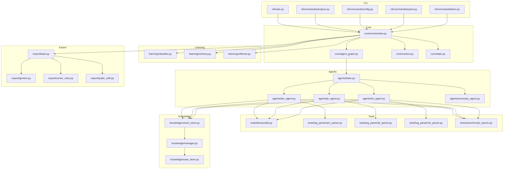
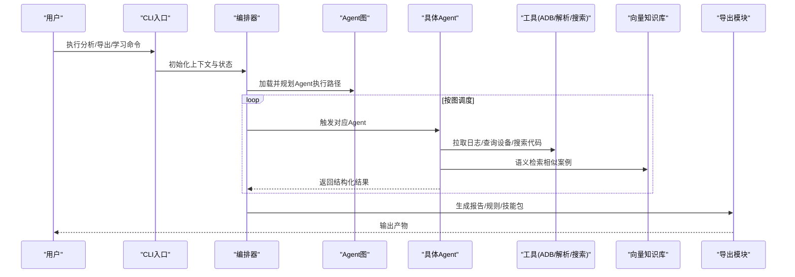
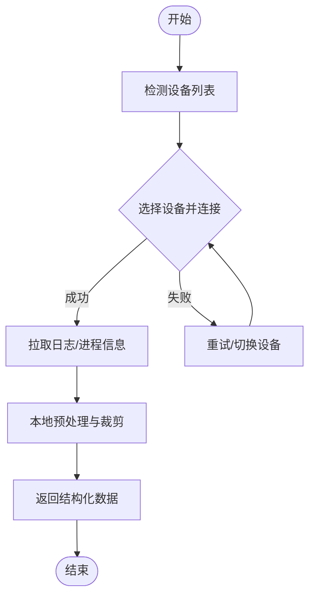
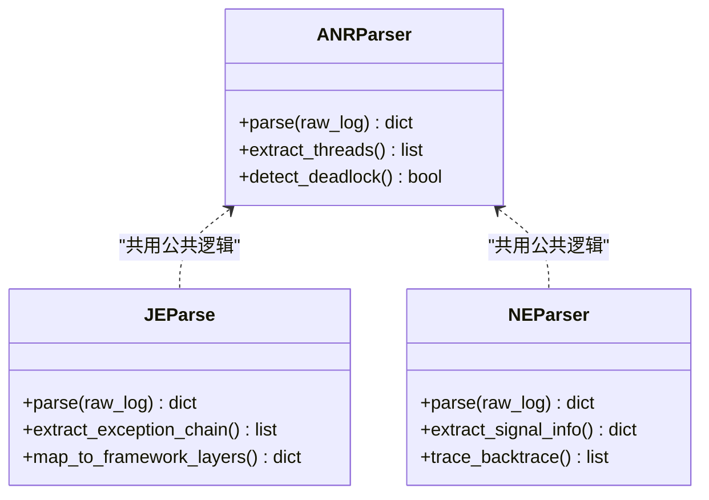
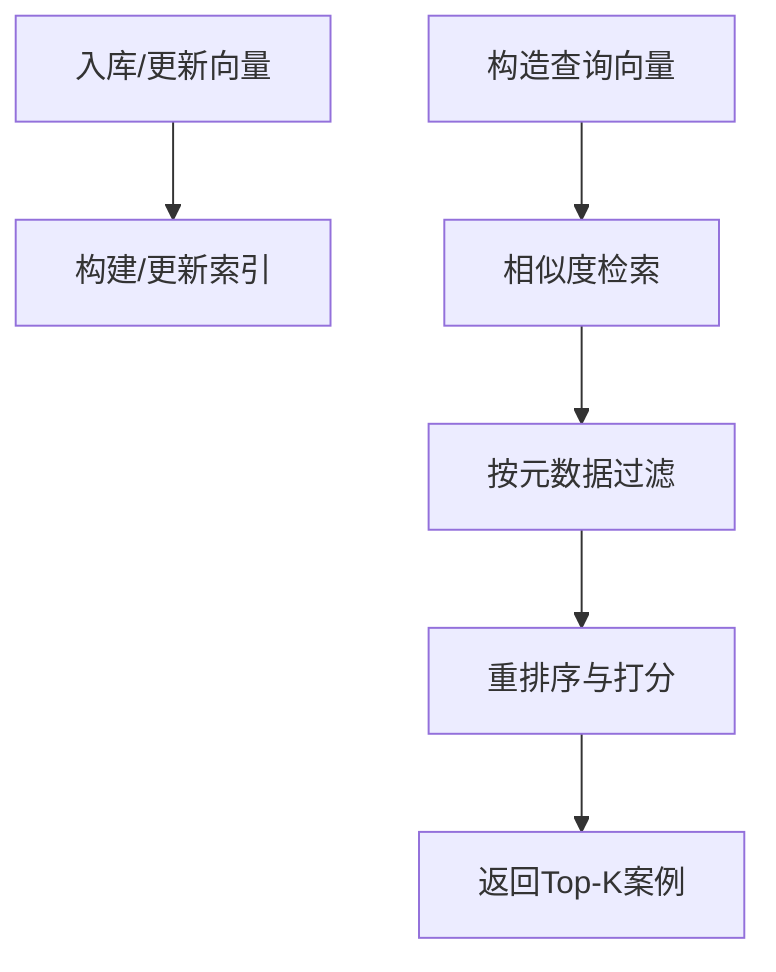
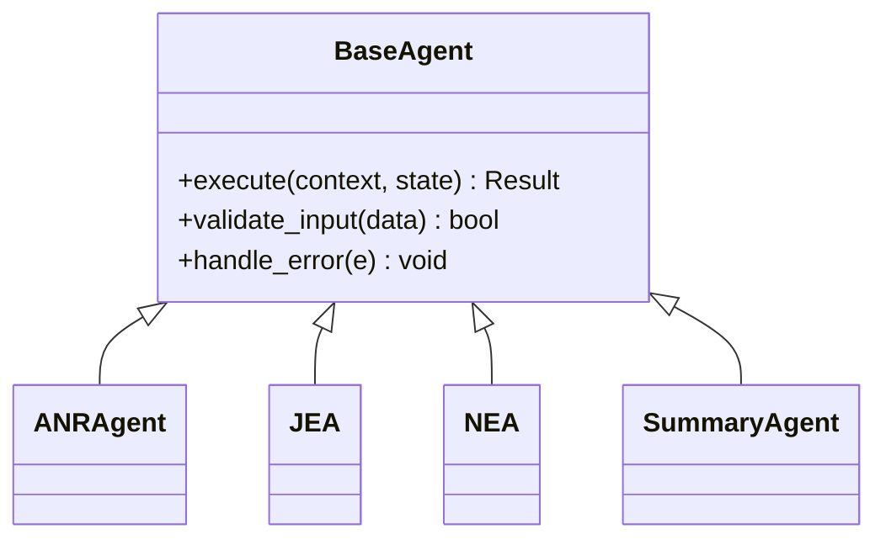
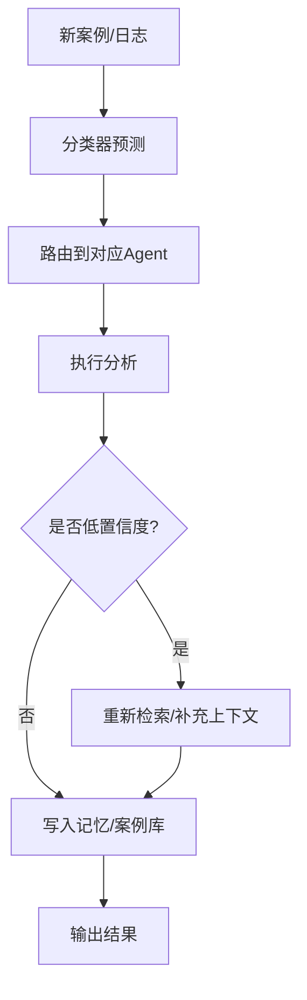
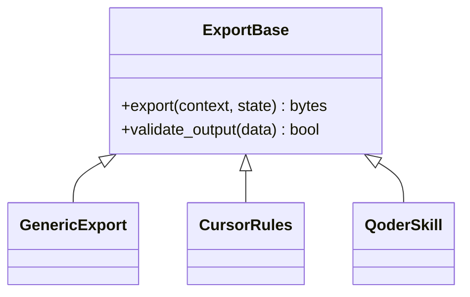
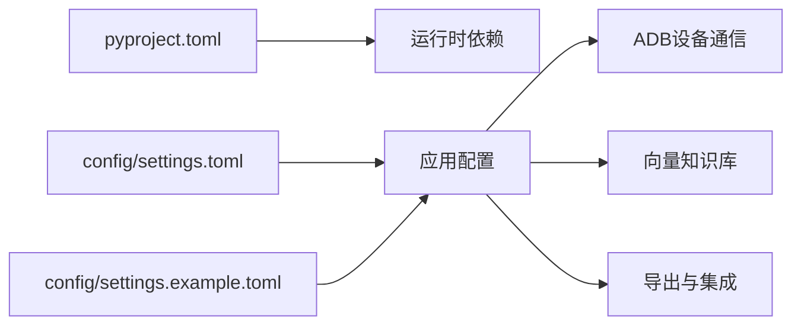

# 技术栈概览

<cite>
**本文引用的文件**   
- [pyproject.toml](file://pyproject.toml)
- [settings.example.toml](file://config/settings.example.toml)
- [main.py](file://src/jirin/cli/main.py)
- [orchestrator.py](file://src/jirin/core/orchestrator.py)
- [agent_graph.py](file://src/jirin/core/agent_graph.py)
- [context.py](file://src/jirin/core/context.py)
- [state.py](file://src/jirin/core/state.py)
- [adb.py](file://src/jirin/tools/device/adb.py)
- [anr_parser.py](file://src/jirin/tools/log_parser/anr_parser.py)
- [je_parser.py](file://src/jirin/tools/log_parser/je_parser.py)
- [ne_parser.py](file://src/jirin/tools/log_parser/ne_parser.py)
- [code_search.py](file://src/jirin/tools/search/code_search.py)
- [base.py](file://src/jirin/agents/base.py)
- [anr_agent.py](file://src/jirin/agents/anr_agent.py)
- [je_agent.py](file://src/jirin/agents/je_agent.py)
- [ne_agent.py](file://src/jirin/agents/ne_agent.py)
- [summary_agent.py](file://src/jirin/agents/summary_agent.py)
- [vector_store.py](file://src/jirin/knowledge/vector_store.py)
- [case_store.py](file://src/jirin/knowledge/case_store.py)
- [manager.py](file://src/jirin/knowledge/manager.py)
- [classifier.py](file://src/jirin/learning/classifier.py)
- [memory.py](file://src/jirin/learning/memory.py)
- [reflector.py](file://src/jirin/learning/reflector.py)
- [export_base.py](file://src/jirin/export/base.py)
- [generic_export.py](file://src/jirin/export/generic.py)
- [cursor_rules.py](file://src/jirin/export/cursor_rules.py)
- [qoder_skill.py](file://src/jirin/export/qoder_skill.py)
</cite>

## 目录
1. [简介](#简介)
2. [项目结构](#项目结构)
3. [核心组件](#核心组件)
4. [架构总览](#架构总览)
5. [详细组件分析](#详细组件分析)
6. [依赖关系分析](#依赖关系分析)
7. [性能考量](#性能考量)
8. [故障排查指南](#故障排查指南)
9. [结论](#结论)
10. [附录](#附录)

## 简介
本技术栈概览面向希望深入了解或贡献代码的开发者，系统梳理Jirin的技术基础与选型理由。Jirin基于Python生态构建，围绕Android设备通信（ADB）、日志解析、向量检索与Agent编排展开，形成“感知—理解—决策—执行”的闭环：通过ADB采集设备状态与日志，利用日志解析器识别问题类型，借助向量知识库进行语义检索与案例匹配，最终由多Agent协作完成分析与导出。

## 项目结构
项目采用分层与模块化组织方式：
- CLI层：提供命令行入口与子命令（分析、配置、导出、学习等）
- Core层：编排器、Agent图、上下文与状态管理
- Agents层：针对ANR、Java异常、Native崩溃等场景的专用Agent
- Tools层：设备通信（ADB）、日志解析、代码搜索
- Knowledge层：向量存储、案例库、知识管理
- Learning层：分类器、记忆与反思机制
- Export层：通用导出、Cursor规则、Qoder技能包等

图表来源
- [main.py:1-200](file://src/jirin/cli/main.py#L1-L200)
- [orchestrator.py:1-200](file://src/jirin/core/orchestrator.py#L1-L200)
- [agent_graph.py:1-200](file://src/jirin/core/agent_graph.py#L1-L200)
- [context.py:1-200](file://src/jirin/core/context.py#L1-L200)
- [state.py:1-200](file://src/jirin/core/state.py#L1-L200)
- [adb.py:1-200](file://src/jirin/tools/device/adb.py#L1-L200)
- [anr_parser.py:1-200](file://src/jirin/tools/log_parser/anr_parser.py#L1-L200)
- [je_parser.py:1-200](file://src/jirin/tools/log_parser/je_parser.py#L1-L200)
- [ne_parser.py:1-200](file://src/jirin/tools/log_parser/ne_parser.py#L1-L200)
- [code_search.py:1-200](file://src/jirin/tools/search/code_search.py#L1-L200)
- [base.py:1-200](file://src/jirin/agents/base.py#L1-L200)
- [anr_agent.py:1-200](file://src/jirin/agents/anr_agent.py#L1-L200)
- [je_agent.py:1-200](file://src/jirin/agents/je_agent.py#L1-L200)
- [ne_agent.py:1-200](file://src/jirin/agents/ne_agent.py#L1-L200)
- [summary_agent.py:1-200](file://src/jirin/agents/summary_agent.py#L1-L200)
- [vector_store.py:1-200](file://src/jirin/knowledge/vector_store.py#L1-L200)
- [case_store.py:1-200](file://src/jirin/knowledge/case_store.py#L1-L200)
- [manager.py:1-200](file://src/jirin/knowledge/manager.py#L1-L200)
- [classifier.py:1-200](file://src/jirin/learning/classifier.py#L1-L200)
- [memory.py:1-200](file://src/jirin/learning/memory.py#L1-L200)
- [reflector.py:1-200](file://src/jirin/learning/reflector.py#L1-L200)
- [export_base.py:1-200](file://src/jirin/export/base.py#L1-L200)
- [generic_export.py:1-200](file://src/jirin/export/generic.py#L1-L200)
- [cursor_rules.py:1-200](file://src/jirin/export/cursor_rules.py#L1-L200)
- [qoder_skill.py:1-200](file://src/jirin/export/qoder_skill.py#L1-L200)

章节来源
- [main.py:1-200](file://src/jirin/cli/main.py#L1-L200)
- [orchestrator.py:1-200](file://src/jirin/core/orchestrator.py#L1-L200)
- [agent_graph.py:1-200](file://src/jirin/core/agent_graph.py#L1-L200)
- [context.py:1-200](file://src/jirin/core/context.py#L1-L200)
- [state.py:1-200](file://src/jirin/core/state.py#L1-L200)

## 核心组件
- 编排器（Orchestrator）：统一调度Agent图、上下文与状态，协调工具调用与导出流程
- Agent图（AgentGraph）：定义Agent间的拓扑与流转策略，支持条件分支与并行
- 上下文（Context）：承载请求参数、中间结果与共享数据
- 状态（State）：持久化与分析阶段的状态机，保证可恢复性与可观测性
- 设备通信（ADB）：封装设备连接、日志拉取、进程与线程信息获取
- 日志解析器：针对ANR、Java异常、Native崩溃的结构化解析
- 向量知识库：用于语义检索与相似案例召回
- 学习模块：分类器、记忆与反思，驱动持续改进
- 导出模块：通用导出、IDE集成规则与技能包生成

章节来源
- [orchestrator.py:1-200](file://src/jirin/core/orchestrator.py#L1-L200)
- [agent_graph.py:1-200](file://src/jirin/core/agent_graph.py#L1-L200)
- [context.py:1-200](file://src/jirin/core/context.py#L1-L200)
- [state.py:1-200](file://src/jirin/core/state.py#L1-L200)
- [adb.py:1-200](file://src/jirin/tools/device/adb.py#L1-L200)
- [anr_parser.py:1-200](file://src/jirin/tools/log_parser/anr_parser.py#L1-L200)
- [je_parser.py:1-200](file://src/jirin/tools/log_parser/je_parser.py#L1-L200)
- [ne_parser.py:1-200](file://src/jirin/tools/log_parser/ne_parser.py#L1-L200)
- [vector_store.py:1-200](file://src/jirin/knowledge/vector_store.py#L1-L200)
- [classifier.py:1-200](file://src/jirin/learning/classifier.py#L1-L200)
- [memory.py:1-200](file://src/jirin/learning/memory.py#L1-L200)
- [reflector.py:1-200](file://src/jirin/learning/reflector.py#L1-L200)
- [export_base.py:1-200](file://src/jirin/export/base.py#L1-L200)
- [generic_export.py:1-200](file://src/jirin/export/generic.py#L1-L200)
- [cursor_rules.py:1-200](file://src/jirin/export/cursor_rules.py#L1-L200)
- [qoder_skill.py:1-200](file://src/jirin/export/qoder_skill.py#L1-L200)

## 架构总览
Jirin采用“CLI驱动 + 编排器 + 多Agent + 工具链 + 知识库 + 学习 + 导出”的分层架构。CLI负责用户交互与命令路由；编排器根据Agent图与上下文决定执行路径；Agent专注特定问题域；工具层屏蔽底层差异（如ADB、日志格式）；知识库提供语义检索与案例复用；学习模块实现经验沉淀；导出模块对接IDE与工作流。

图表来源
- [main.py:1-200](file://src/jirin/cli/main.py#L1-L200)
- [orchestrator.py:1-200](file://src/jirin/core/orchestrator.py#L1-L200)
- [agent_graph.py:1-200](file://src/jirin/core/agent_graph.py#L1-L200)
- [adb.py:1-200](file://src/jirin/tools/device/adb.py#L1-L200)
- [anr_parser.py:1-200](file://src/jirin/tools/log_parser/anr_parser.py#L1-L200)
- [je_parser.py:1-200](file://src/jirin/tools/log_parser/je_parser.py#L1-L200)
- [ne_parser.py:1-200](file://src/jirin/tools/log_parser/ne_parser.py#L1-L200)
- [code_search.py:1-200](file://src/jirin/tools/search/code_search.py#L1-L200)
- [vector_store.py:1-200](file://src/jirin/knowledge/vector_store.py#L1-L200)
- [export_base.py:1-200](file://src/jirin/export/base.py#L1-L200)

## 详细组件分析

### 设备通信框架（ADB）
- 职责：设备发现、连接管理、日志拉取、进程/线程/堆栈信息采集
- 设计要点：
  - 连接池与会话复用，降低重复握手开销
  - 超时与重试策略，提升弱网环境稳定性
  - 错误码映射与诊断信息收集，便于定位设备侧问题
- 与Android生态集成：
  - 使用标准ADB协议，兼容主流Android版本
  - 结合logcat过滤与时间窗口裁剪，减少数据量
  - 对权限与SELinux限制做兼容处理

图表来源
- [adb.py:1-200](file://src/jirin/tools/device/adb.py#L1-L200)

章节来源
- [adb.py:1-200](file://src/jirin/tools/device/adb.py#L1-L200)

### 日志解析器（ANR/Java/Native）
- 职责：将原始日志转换为结构化事件，提取关键线索（线程、锁、异常堆栈、信号等）
- 设计要点：
  - 正则与状态机结合的解析策略，兼顾速度与鲁棒性
  - 字段标准化与归一化，便于后续检索与对比
  - 增量解析与断点续析，支持大日志分片处理
- 与Agent协作：
  - 为ANR/Java/Native Agent提供高内聚输入
  - 输出包含时间线、根因候选与置信度评分

图表来源
- [anr_parser.py:1-200](file://src/jirin/tools/log_parser/anr_parser.py#L1-L200)
- [je_parser.py:1-200](file://src/jirin/tools/log_parser/je_parser.py#L1-L200)
- [ne_parser.py:1-200](file://src/jirin/tools/log_parser/ne_parser.py#L1-L200)

章节来源
- [anr_parser.py:1-200](file://src/jirin/tools/log_parser/anr_parser.py#L1-L200)
- [je_parser.py:1-200](file://src/jirin/tools/log_parser/je_parser.py#L1-L200)
- [ne_parser.py:1-200](file://src/jirin/tools/log_parser/ne_parser.py#L1-L200)

### 向量数据库与语义搜索
- 职责：将案例与知识向量化，支持相似度检索与跨语言/术语对齐
- 设计要点：
  - 文本嵌入与索引策略，平衡召回率与延迟
  - 元数据过滤（设备型号、Android版本、应用包名等）
  - 增量更新与批量导入，保障知识库时效性
- 与Agent协作：
  - 在分析前进行相似案例召回，辅助根因定位
  - 在导出时生成“参考案例”链接与摘要

图表来源
- [vector_store.py:1-200](file://src/jirin/knowledge/vector_store.py#L1-L200)
- [manager.py:1-200](file://src/jirin/knowledge/manager.py#L1-L200)
- [case_store.py:1-200](file://src/jirin/knowledge/case_store.py#L1-L200)

章节来源
- [vector_store.py:1-200](file://src/jirin/knowledge/vector_store.py#L1-L200)
- [manager.py:1-200](file://src/jirin/knowledge/manager.py#L1-L200)
- [case_store.py:1-200](file://src/jirin/knowledge/case_store.py#L1-L200)

### Agent架构模式
- 基类与继承：所有Agent继承自统一基类，规范生命周期、输入输出与错误处理
- 专用Agent：
  - ANR Agent：聚焦主线程阻塞、死锁、IO等待等
  - Java异常 Agent：异常链追踪、框架层映射
  - Native崩溃 Agent：信号、backtrace、内存越界等
  - 汇总Agent：聚合各Agent结论，生成可读报告
- 编排与图：
  - 通过Agent图定义顺序、条件分支与并行
  - 上下文贯穿全链路，状态机记录阶段与里程碑

图表来源
- [base.py:1-200](file://src/jirin/agents/base.py#L1-L200)
- [anr_agent.py:1-200](file://src/jirin/agents/anr_agent.py#L1-L200)
- [je_agent.py:1-200](file://src/jirin/agents/je_agent.py#L1-L200)
- [ne_agent.py:1-200](file://src/jirin/agents/ne_agent.py#L1-L200)
- [summary_agent.py:1-200](file://src/jirin/agents/summary_agent.py#L1-L200)

章节来源
- [base.py:1-200](file://src/jirin/agents/base.py#L1-L200)
- [anr_agent.py:1-200](file://src/jirin/agents/anr_agent.py#L1-L200)
- [je_agent.py:1-200](file://src/jirin/agents/je_agent.py#L1-L200)
- [ne_agent.py:1-200](file://src/jirin/agents/ne_agent.py#L1-L200)
- [summary_agent.py:1-200](file://src/jirin/agents/summary_agent.py#L1-L200)

### 学习与反思机制
- 分类器：对问题类型进行自动归类，指导Agent路由
- 记忆：缓存高频模式与有效策略，缩短后续分析路径
- 反思：对低置信度结果进行二次校验与修正

图表来源
- [classifier.py:1-200](file://src/jirin/learning/classifier.py#L1-L200)
- [memory.py:1-200](file://src/jirin/learning/memory.py#L1-L200)
- [reflector.py:1-200](file://src/jirin/learning/reflector.py#L1-L200)

章节来源
- [classifier.py:1-200](file://src/jirin/learning/classifier.py#L1-L200)
- [memory.py:1-200](file://src/jirin/learning/memory.py#L1-L200)
- [reflector.py:1-200](file://src/jirin/learning/reflector.py#L1-L200)

### 导出与插件化
- 导出基类：统一导出接口，支持多种目标格式
- 通用导出：JSON/YAML/Markdown等
- IDE集成：Cursor规则导出，便于在编辑器中快速定位与修复
- 技能包：打包为Qoder技能，支持一键安装与复用

图表来源
- [export_base.py:1-200](file://src/jirin/export/base.py#L1-L200)
- [generic_export.py:1-200](file://src/jirin/export/generic.py#L1-L200)
- [cursor_rules.py:1-200](file://src/jirin/export/cursor_rules.py#L1-L200)
- [qoder_skill.py:1-200](file://src/jirin/export/qoder_skill.py#L1-L200)

章节来源
- [export_base.py:1-200](file://src/jirin/export/base.py#L1-L200)
- [generic_export.py:1-200](file://src/jirin/export/generic.py#L1-L200)
- [cursor_rules.py:1-200](file://src/jirin/export/cursor_rules.py#L1-L200)
- [qoder_skill.py:1-200](file://src/jirin/export/qoder_skill.py#L1-L200)

## 依赖关系分析
- Python生态：以pyproject.toml声明依赖，便于环境管理与可复现构建
- 配置管理：settings.toml与示例配置分离，支持覆盖与环境变量注入
- 外部集成：
  - ADB：作为Android设备通信桥梁
  - 向量库：用于语义检索与案例召回
  - IDE/工作流：通过导出规则与技能包接入

图表来源
- [pyproject.toml:1-200](file://pyproject.toml#L1-L200)
- [settings.example.toml:1-200](file://config/settings.example.toml#L1-L200)

章节来源
- [pyproject.toml:1-200](file://pyproject.toml#L1-L200)
- [settings.example.toml:1-200](file://config/settings.example.toml#L1-L200)

## 性能考量
- 设备通信：
  - 连接复用与并发拉取，避免串行瓶颈
  - 日志裁剪与分页读取，控制内存占用
- 解析与检索：
  - 解析器采用流式处理，降低峰值内存
  - 向量检索引入预过滤与近似最近邻，提升吞吐
- 编排与状态：
  - 状态序列化与检查点，支持中断恢复
  - 任务去重与短路策略，减少无效计算

[本节为通用性能建议，不直接分析具体文件]

## 故障排查指南
- ADB连接问题：
  - 检查设备枚举与权限，确认端口占用与防火墙设置
  - 查看重试与超时日志，必要时切换设备或重启服务
- 日志解析失败：
  - 核对日志版本与格式变化，更新解析规则
  - 启用增量解析，定位断点位置
- 向量检索不准：
  - 调整嵌入模型与权重，优化元数据过滤条件
  - 扩充高质量案例，提升召回质量
- 导出异常：
  - 校验模板与占位符，确保上下文字段完整
  - 检查目标平台兼容性（IDE版本、技能包格式）

章节来源
- [adb.py:1-200](file://src/jirin/tools/device/adb.py#L1-L200)
- [anr_parser.py:1-200](file://src/jirin/tools/log_parser/anr_parser.py#L1-L200)
- [je_parser.py:1-200](file://src/jirin/tools/log_parser/je_parser.py#L1-L200)
- [ne_parser.py:1-200](file://src/jirin/tools/log_parser/ne_parser.py#L1-L200)
- [vector_store.py:1-200](file://src/jirin/knowledge/vector_store.py#L1-L200)
- [export_base.py:1-200](file://src/jirin/export/base.py#L1-L200)

## 结论
Jirin以Python为核心，结合ADB、日志解析、向量检索与Agent编排，构建了可扩展、可学习的Android问题分析体系。其模块化与插件化设计使新增问题域与导出目标变得简单可控。未来可在嵌入模型、检索策略与设备通信效率上持续演进，进一步提升准确率与性能。

[本节为总结性内容，不直接分析具体文件]

## 附录
- 版本兼容性要求：
  - Python：遵循pyproject.toml声明的最小版本
  - Android：适配常见版本范围，关注ADB协议变更
  - 向量库：依据embedding与索引后端能力选择版本
- 扩展机制：
  - 新增Agent：继承基类，注册至Agent图
  - 新增导出：实现导出基类，纳入CLI导出命令
  - 新增解析器：遵循公共接口，完善测试用例
- 最佳实践：
  - 配置与环境隔离，使用示例配置作为基准
  - 日志与状态可观测，便于问题定位
  - 向量知识库定期维护，保持案例质量

章节来源
- [pyproject.toml:1-200](file://pyproject.toml#L1-L200)
- [settings.example.toml:1-200](file://config/settings.example.toml#L1-L200)
- [base.py:1-200](file://src/jirin/agents/base.py#L1-L200)
- [export_base.py:1-200](file://src/jirin/export/base.py#L1-L200)