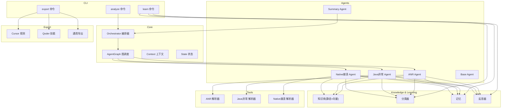
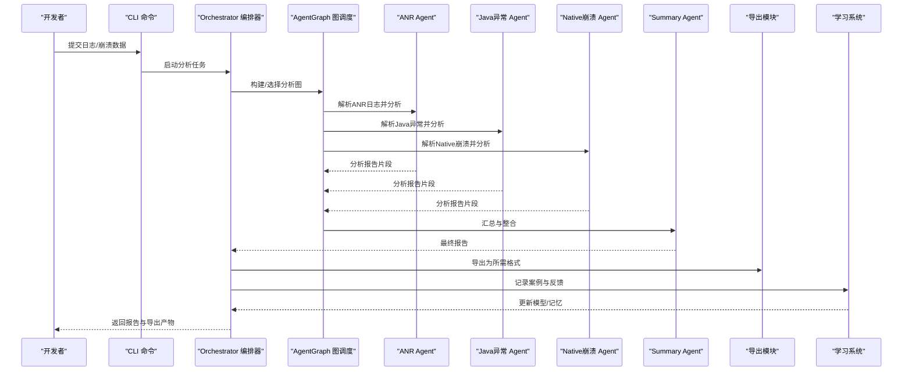
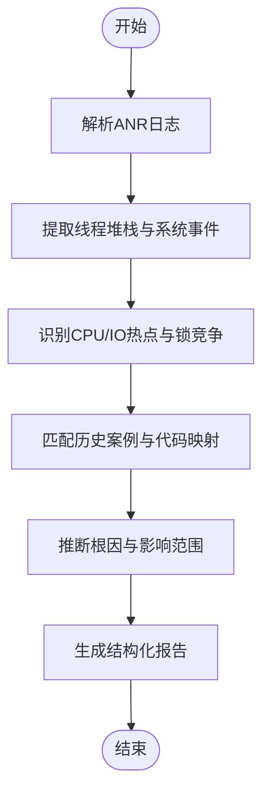
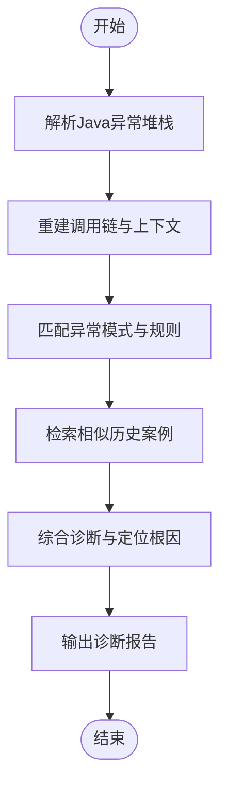
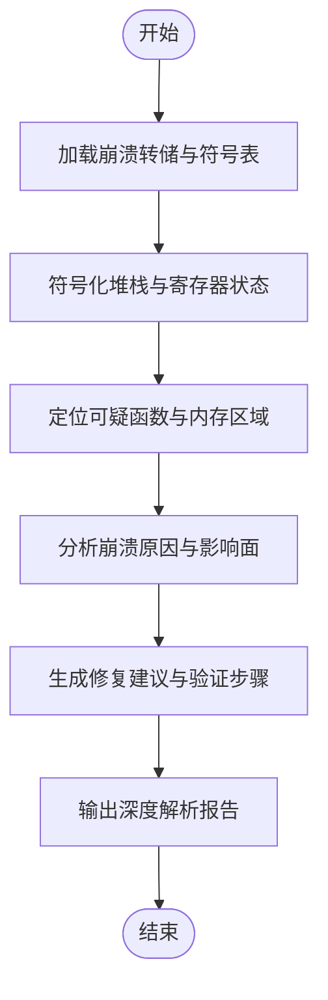
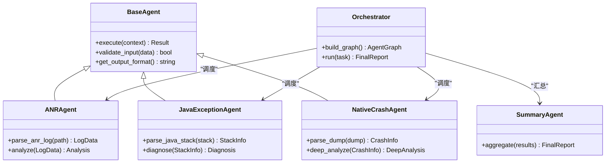
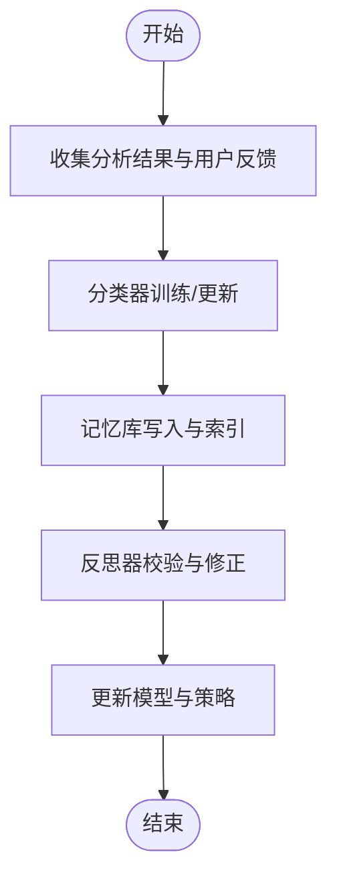
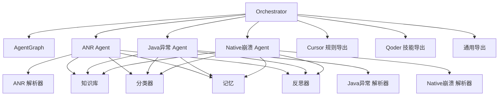

# 核心功能特性

<cite>
**本文引用的文件**   
- [src/jirin/agents/anr_agent.py](file://src/jirin/agents/anr_agent.py)
- [src/jirin/agents/je_agent.py](file://src/jirin/agents/je_agent.py)
- [src/jirin/agents/ne_agent.py](file://src/jirin/agents/ne_agent.py)
- [src/jirin/agents/base.py](file://src/jirin/agents/base.py)
- [src/jirin/core/orchestrator.py](file://src/jirin/core/orchestrator.py)
- [src/jirin/core/agent_graph.py](file://src/jirin/core/agent_graph.py)
- [src/jirin/tools/log_parser/anr_parser.py](file://src/jirin/tools/log_parser/anr_parser.py)
- [src/jirin/tools/log_parser/je_parser.py](file://src/jirin/tools/log_parser/je_parser.py)
- [src/jirin/tools/log_parser/ne_parser.py](file://src/jirin/tools/log_parser/ne_parser.py)
- [src/jirin/knowledge/static/anr_principles.md](file://src/jirin/knowledge/static/anr_principles.md)
- [src/jirin/knowledge/static/je_principles.md](file://src/jirin/knowledge/static/je_principles.md)
- [src/jirin/knowledge/static/ne_principles.md](file://src/jirin/knowledge/static/ne_principles.md)
- [src/jirin/export/cursor_rules.py](file://src/jirin/export/cursor_rules.py)
- [src/jirin/export/qoder_skill.py](file://src/jirin/export/qoder_skill.py)
- [src/jirin/export/generic.py](file://src/jirin/export/generic.py)
- [src/jirin/learning/classifier.py](file://src/jirin/learning/classifier.py)
- [src/jirin/learning/memory.py](file://src/jirin/learning/memory.py)
- [src/jirin/learning/reflector.py](file://src/jirin/learning/reflector.py)
- [src/jirin/cli/commands/analyze.py](file://src/jirin/cli/commands/analyze.py)
- [src/jirin/cli/commands/export.py](file://src/jirin/cli/commands/export.py)
- [src/jirin/cli/commands/learn.py](file://src/jirin/cli/commands/learn.py)
</cite>

## 目录
1. [简介](#简介)
2. [项目结构](#项目结构)
3. [核心组件](#核心组件)
4. [架构总览](#架构总览)
5. [详细组件分析](#详细组件分析)
6. [依赖分析](#依赖分析)
7. [性能考虑](#性能考虑)
8. [故障排查指南](#故障排查指南)
9. [结论](#结论)
10. [附录](#附录)

## 简介
本章节面向开发者，系统性介绍 Jirin 的三大核心分析能力：ANR（应用无响应）智能分析、Java异常自动诊断、Native崩溃深度解析。文档将阐述每种崩溃类型的检测原理、分析方法与输出结果格式；说明 Agent 协作模式如何实现多代理协同工作；解释学习系统如何持续提升分析准确性；并展示导出格式支持情况（Cursor规则、Qoder技能等）。文末提供功能对比表格、使用场景推荐、输入输出示例与最佳实践建议，帮助快速选择合适的分析策略。

## 项目结构
Jirin 采用“工具解析 + Agent 分析 + 编排器调度 + 知识/学习支撑 + 导出”的分层设计。关键目录与职责如下：
- agents：各类型崩溃分析的专用 Agent（ANR、Java异常、Native崩溃），以及基类与汇总 Agent
- core：Agent 编排器与图式调度、上下文与状态管理
- tools/log_parser：日志解析器（ANR、Java异常、Native崩溃）
- knowledge：静态知识与向量存储，用于检索与增强分析
- learning：分类器、记忆与反思模块，驱动持续学习与优化
- export：多种导出目标（Cursor规则、Qoder技能、通用格式）
- cli：命令行入口与分析、导出、学习命令

图表来源
- [src/jirin/core/orchestrator.py](file://src/jirin/core/orchestrator.py)
- [src/jirin/core/agent_graph.py](file://src/jirin/core/agent_graph.py)
- [src/jirin/agents/anr_agent.py](file://src/jirin/agents/anr_agent.py)
- [src/jirin/agents/je_agent.py](file://src/jirin/agents/je_agent.py)
- [src/jirin/agents/ne_agent.py](file://src/jirin/agents/ne_agent.py)
- [src/jirin/tools/log_parser/anr_parser.py](file://src/jirin/tools/log_parser/anr_parser.py)
- [src/jirin/tools/log_parser/je_parser.py](file://src/jirin/tools/log_parser/je_parser.py)
- [src/jirin/tools/log_parser/ne_parser.py](file://src/jirin/tools/log_parser/ne_parser.py)
- [src/jirin/knowledge/vector_store.py](file://src/jirin/knowledge/vector_store.py)
- [src/jirin/learning/classifier.py](file://src/jirin/learning/classifier.py)
- [src/jirin/learning/memory.py](file://src/jirin/learning/memory.py)
- [src/jirin/learning/reflector.py](file://src/jirin/learning/reflector.py)
- [src/jirin/export/cursor_rules.py](file://src/jirin/export/cursor_rules.py)
- [src/jirin/export/qoder_skill.py](file://src/jirin/export/qoder_skill.py)
- [src/jirin/export/generic.py](file://src/jirin/export/generic.py)
- [src/jirin/cli/commands/analyze.py](file://src/jirin/cli/commands/analyze.py)
- [src/jirin/cli/commands/export.py](file://src/jirin/cli/commands/export.py)
- [src/jirin/cli/commands/learn.py](file://src/jirin/cli/commands/learn.py)

章节来源
- [src/jirin/cli/commands/analyze.py](file://src/jirin/cli/commands/analyze.py)
- [src/jirin/cli/commands/export.py](file://src/jirin/cli/commands/export.py)
- [src/jirin/cli/commands/learn.py](file://src/jirin/cli/commands/learn.py)
- [src/jirin/core/orchestrator.py](file://src/jirin/core/orchestrator.py)
- [src/jirin/core/agent_graph.py](file://src/jirin/core/agent_graph.py)

## 核心组件
本节聚焦三大分析能力与协作机制的关键实现要点。

- ANR 智能分析
  - 检测原理：基于系统日志中的线程阻塞、主线程长时间无响应、Looper 超时等信号进行定位
  - 分析方法：解析 ANR 日志，提取堆栈、CPU/IO 热点、锁竞争线索，结合代码映射与历史案例进行根因推断
  - 输出结果：结构化报告（问题摘要、关键堆栈、可能原因、修复建议、证据片段）

- Java异常自动诊断
  - 检测原理：识别未捕获异常、常见异常模式（空指针、越界、资源泄漏等）
  - 分析方法：解析 Java 堆栈，关联业务上下文与调用链，匹配已知模式库与向量检索相似案例
  - 输出结果：异常类型、触发路径、影响范围、修复建议与验证步骤

- Native崩溃深度解析
  - 检测原理：解析崩溃转储、符号表、寄存器状态、信号信息，还原崩溃现场
  - 分析方法：符号化堆栈、定位越界/空指针/内存破坏等底层问题，结合源码映射给出修复指引
  - 输出结果：崩溃地址、符号化堆栈、可疑函数、内存状态、修复建议

- Agent 协作模式
  - 多代理协同：ANR/Java/Native 三类 Agent 并行或串行执行，由编排器根据输入类型与上下文动态调度
  - 统一接口：所有 Agent 继承基类，遵循一致的输入/输出契约，便于扩展与组合
  - 汇总阶段：Summary Agent 聚合各 Agent 发现，生成最终报告与建议

- 学习系统
  - 分类器：对问题类型进行自动分类，提升路由与匹配精度
  - 记忆：沉淀历史案例与经验，形成可检索的知识资产
  - 反思器：对分析结果进行自我校验与修正，持续优化策略

章节来源
- [src/jirin/agents/anr_agent.py](file://src/jirin/agents/anr_agent.py)
- [src/jirin/agents/je_agent.py](file://src/jirin/agents/je_agent.py)
- [src/jirin/agents/ne_agent.py](file://src/jirin/agents/ne_agent.py)
- [src/jirin/agents/base.py](file://src/jirin/agents/base.py)
- [src/jirin/tools/log_parser/anr_parser.py](file://src/jirin/tools/log_parser/anr_parser.py)
- [src/jirin/tools/log_parser/je_parser.py](file://src/jirin/tools/log_parser/je_parser.py)
- [src/jirin/tools/log_parser/ne_parser.py](file://src/jirin/tools/log_parser/ne_parser.py)
- [src/jirin/knowledge/static/anr_principles.md](file://src/jirin/knowledge/static/anr_principles.md)
- [src/jirin/knowledge/static/je_principles.md](file://src/jirin/knowledge/static/je_principles.md)
- [src/jirin/knowledge/static/ne_principles.md](file://src/jirin/knowledge/static/ne_principles.md)
- [src/jirin/learning/classifier.py](file://src/jirin/learning/classifier.py)
- [src/jirin/learning/memory.py](file://src/jirin/learning/memory.py)
- [src/jirin/learning/reflector.py](file://src/jirin/learning/reflector.py)

## 架构总览
下图展示了从 CLI 到 Agent 分析、再到导出与学习的端到端流程。

图表来源
- [src/jirin/cli/commands/analyze.py](file://src/jirin/cli/commands/analyze.py)
- [src/jirin/core/orchestrator.py](file://src/jirin/core/orchestrator.py)
- [src/jirin/core/agent_graph.py](file://src/jirin/core/agent_graph.py)
- [src/jirin/agents/anr_agent.py](file://src/jirin/agents/anr_agent.py)
- [src/jirin/agents/je_agent.py](file://src/jirin/agents/je_agent.py)
- [src/jirin/agents/ne_agent.py](file://src/jirin/agents/ne_agent.py)
- [src/jirin/agents/summary_agent.py](file://src/jirin/agents/summary_agent.py)
- [src/jirin/export/cursor_rules.py](file://src/jirin/export/cursor_rules.py)
- [src/jirin/export/qoder_skill.py](file://src/jirin/export/qoder_skill.py)
- [src/jirin/export/generic.py](file://src/jirin/export/generic.py)
- [src/jirin/learning/classifier.py](file://src/jirin/learning/classifier.py)
- [src/jirin/learning/memory.py](file://src/jirin/learning/memory.py)
- [src/jirin/learning/reflector.py](file://src/jirin/learning/reflector.py)

## 详细组件分析

### ANR 智能分析
- 检测原理
  - 通过系统日志中主线程阻塞、Looper 超时、InputDispatcher 警告等信号判定 ANR
  - 结合 CPU/IO 热点与锁竞争线索，定位耗时操作与同步瓶颈
- 分析方法
  - 解析 ANR 日志，抽取线程堆栈、系统事件、进程状态
  - 利用代码映射与历史案例进行相似度匹配，辅助根因推断
  - 输出包含问题摘要、关键堆栈、可能原因、修复建议与证据片段的结构化报告
- 输出结果格式
  - 字段包括：问题类型、时间戳、受影响模块、关键堆栈、可能原因、修复建议、证据片段、置信度评分
- 流程图（算法级）

图表来源
- [src/jirin/tools/log_parser/anr_parser.py](file://src/jirin/tools/log_parser/anr_parser.py)
- [src/jirin/knowledge/static/anr_principles.md](file://src/jirin/knowledge/static/anr_principles.md)
- [src/jirin/agents/anr_agent.py](file://src/jirin/agents/anr_agent.py)

章节来源
- [src/jirin/tools/log_parser/anr_parser.py](file://src/jirin/tools/log_parser/anr_parser.py)
- [src/jirin/knowledge/static/anr_principles.md](file://src/jirin/knowledge/static/anr_principles.md)
- [src/jirin/agents/anr_agent.py](file://src/jirin/agents/anr_agent.py)

### Java异常自动诊断
- 检测原理
  - 识别未捕获异常与常见异常模式，如空指针、越界、资源泄漏、并发问题等
- 分析方法
  - 解析 Java 堆栈，重建调用链，关联业务上下文
  - 使用向量检索与分类器匹配相似案例，提高诊断准确率
  - 输出异常类型、触发路径、影响范围、修复建议与验证步骤
- 流程图（算法级）

图表来源
- [src/jirin/tools/log_parser/je_parser.py](file://src/jirin/tools/log_parser/je_parser.py)
- [src/jirin/knowledge/static/je_principles.md](file://src/jirin/knowledge/static/je_principles.md)
- [src/jirin/agents/je_agent.py](file://src/jirin/agents/je_agent.py)

章节来源
- [src/jirin/tools/log_parser/je_parser.py](file://src/jirin/tools/log_parser/je_parser.py)
- [src/jirin/knowledge/static/je_principles.md](file://src/jirin/knowledge/static/je_principles.md)
- [src/jirin/agents/je_agent.py](file://src/jirin/agents/je_agent.py)

### Native崩溃深度解析
- 检测原理
  - 解析崩溃转储、符号表、寄存器状态与信号信息，还原崩溃现场
- 分析方法
  - 符号化堆栈，定位越界、空指针、内存破坏等底层问题
  - 结合源码映射与平台差异，给出修复指引与规避建议
- 流程图（算法级）

图表来源
- [src/jirin/tools/log_parser/ne_parser.py](file://src/jirin/tools/log_parser/ne_parser.py)
- [src/jirin/knowledge/static/ne_principles.md](file://src/jirin/knowledge/static/ne_principles.md)
- [src/jirin/agents/ne_agent.py](file://src/jirin/agents/ne_agent.py)

章节来源
- [src/jirin/tools/log_parser/ne_parser.py](file://src/jirin/tools/log_parser/ne_parser.py)
- [src/jirin/knowledge/static/ne_principles.md](file://src/jirin/knowledge/static/ne_principles.md)
- [src/jirin/agents/ne_agent.py](file://src/jirin/agents/ne_agent.py)

### Agent 协作模式
- 多代理协同
  - 编排器根据输入类型与上下文动态选择与调度 Agent
  - 各 Agent 并行或串行执行，统一接口便于组合与扩展
- 图式调度
  - 使用 AgentGraph 定义节点与边，控制执行顺序与条件分支
- 汇总与整合
  - Summary Agent 聚合各 Agent 发现，生成最终报告与建议
- 类关系图（代码级）

图表来源
- [src/jirin/agents/base.py](file://src/jirin/agents/base.py)
- [src/jirin/agents/anr_agent.py](file://src/jirin/agents/anr_agent.py)
- [src/jirin/agents/je_agent.py](file://src/jirin/agents/je_agent.py)
- [src/jirin/agents/ne_agent.py](file://src/jirin/agents/ne_agent.py)
- [src/jirin/agents/summary_agent.py](file://src/jirin/agents/summary_agent.py)
- [src/jirin/core/orchestrator.py](file://src/jirin/core/orchestrator.py)
- [src/jirin/core/agent_graph.py](file://src/jirin/core/agent_graph.py)

章节来源
- [src/jirin/agents/base.py](file://src/jirin/agents/base.py)
- [src/jirin/agents/anr_agent.py](file://src/jirin/agents/anr_agent.py)
- [src/jirin/agents/je_agent.py](file://src/jirin/agents/je_agent.py)
- [src/jirin/agents/ne_agent.py](file://src/jirin/agents/ne_agent.py)
- [src/jirin/agents/summary_agent.py](file://src/jirin/agents/summary_agent.py)
- [src/jirin/core/orchestrator.py](file://src/jirin/core/orchestrator.py)
- [src/jirin/core/agent_graph.py](file://src/jirin/core/agent_graph.py)

### 学习系统与持续优化
- 分类器
  - 对问题类型进行自动分类，提升路由与匹配精度
- 记忆
  - 沉淀历史案例与经验，形成可检索的知识资产
- 反思器
  - 对分析结果进行自我校验与修正，持续优化策略
- 学习流程图（算法级）

图表来源
- [src/jirin/learning/classifier.py](file://src/jirin/learning/classifier.py)
- [src/jirin/learning/memory.py](file://src/jirin/learning/memory.py)
- [src/jirin/learning/reflector.py](file://src/jirin/learning/reflector.py)

章节来源
- [src/jirin/learning/classifier.py](file://src/jirin/learning/classifier.py)
- [src/jirin/learning/memory.py](file://src/jirin/learning/memory.py)
- [src/jirin/learning/reflector.py](file://src/jirin/learning/reflector.py)

## 依赖分析
- 组件耦合与内聚
  - Agents 与 Tools 低耦合，通过统一接口交互
  - Core 编排器与 AgentGraph 解耦，便于扩展新的分析流程
- 外部依赖与集成点
  - 日志解析器依赖平台日志格式与符号化工具
  - 导出模块对接 Cursor 规则与 Qoder 技能生态
- 潜在循环依赖
  - 当前设计避免循环依赖，Agent 不直接依赖编排器内部实现
- 依赖关系图（代码级）

图表来源
- [src/jirin/core/orchestrator.py](file://src/jirin/core/orchestrator.py)
- [src/jirin/core/agent_graph.py](file://src/jirin/core/agent_graph.py)
- [src/jirin/agents/anr_agent.py](file://src/jirin/agents/anr_agent.py)
- [src/jirin/agents/je_agent.py](file://src/jirin/agents/je_agent.py)
- [src/jirin/agents/ne_agent.py](file://src/jirin/agents/ne_agent.py)
- [src/jirin/tools/log_parser/anr_parser.py](file://src/jirin/tools/log_parser/anr_parser.py)
- [src/jirin/tools/log_parser/je_parser.py](file://src/jirin/tools/log_parser/je_parser.py)
- [src/jirin/tools/log_parser/ne_parser.py](file://src/jirin/tools/log_parser/ne_parser.py)
- [src/jirin/knowledge/vector_store.py](file://src/jirin/knowledge/vector_store.py)
- [src/jirin/learning/classifier.py](file://src/jirin/learning/classifier.py)
- [src/jirin/learning/memory.py](file://src/jirin/learning/memory.py)
- [src/jirin/learning/reflector.py](file://src/jirin/learning/reflector.py)
- [src/jirin/export/cursor_rules.py](file://src/jirin/export/cursor_rules.py)
- [src/jirin/export/qoder_skill.py](file://src/jirin/export/qoder_skill.py)
- [src/jirin/export/generic.py](file://src/jirin/export/generic.py)

章节来源
- [src/jirin/core/orchestrator.py](file://src/jirin/core/orchestrator.py)
- [src/jirin/core/agent_graph.py](file://src/jirin/core/agent_graph.py)
- [src/jirin/agents/anr_agent.py](file://src/jirin/agents/anr_agent.py)
- [src/jirin/agents/je_agent.py](file://src/jirin/agents/je_agent.py)
- [src/jirin/agents/ne_agent.py](file://src/jirin/agents/ne_agent.py)
- [src/jirin/tools/log_parser/anr_parser.py](file://src/jirin/tools/log_parser/anr_parser.py)
- [src/jirin/tools/log_parser/je_parser.py](file://src/jirin/tools/log_parser/je_parser.py)
- [src/jirin/tools/log_parser/ne_parser.py](file://src/jirin/tools/log_parser/ne_parser.py)
- [src/jirin/knowledge/vector_store.py](file://src/jirin/knowledge/vector_store.py)
- [src/jirin/learning/classifier.py](file://src/jirin/learning/classifier.py)
- [src/jirin/learning/memory.py](file://src/jirin/learning/memory.py)
- [src/jirin/learning/reflector.py](file://src/jirin/learning/reflector.py)
- [src/jirin/export/cursor_rules.py](file://src/jirin/export/cursor_rules.py)
- [src/jirin/export/qoder_skill.py](file://src/jirin/export/qoder_skill.py)
- [src/jirin/export/generic.py](file://src/jirin/export/generic.py)

## 性能考虑
- 解析与符号化
  - 大日志与转储文件建议使用增量解析与流式处理，降低内存占用
  - 符号化过程可缓存符号表，减少重复计算
- 并发与并行
  - 多 Agent 并行执行时注意资源隔离与限流，避免 I/O 争用
- 缓存与复用
  - 历史案例与向量索引应定期更新与压缩，提升检索效率
- 导出优化
  - 批量导出时合并中间结果，减少磁盘 I/O 次数

[本节为通用指导，无需特定文件引用]

## 故障排查指南
- 常见问题
  - 日志缺失或不完整：确保采集全量系统日志与崩溃转储，必要时开启调试开关
  - 符号表缺失：检查符号表路径与版本一致性，确保符号化可用
  - 导出失败：确认目标格式配置正确，权限与路径有效
- 定位方法
  - 查看编排器日志与 Agent 执行轨迹，定位失败节点
  - 使用学习系统的反思器输出，获取自检与修正建议
- 恢复策略
  - 重试与降级：对网络或外部依赖失败进行重试与降级处理
  - 回滚与快照：在导入新模型或知识前创建快照，便于回滚

章节来源
- [src/jirin/core/orchestrator.py](file://src/jirin/core/orchestrator.py)
- [src/jirin/learning/reflector.py](file://src/jirin/learning/reflector.py)

## 结论
Jirin 通过模块化设计与多 Agent 协作，实现了 ANR、Java异常与 Native崩溃的全面分析与诊断。借助学习系统与知识检索，分析准确性随使用持续优化。同时，丰富的导出格式支持与灵活的编排调度，使其能够适配不同团队与工作流需求。建议在实际项目中优先启用学习系统，并结合导出格式沉淀团队规范与最佳实践。

[本节为总结性内容，无需特定文件引用]

## 附录

### 功能对比表格
- 维度：检测原理、分析方法、输出结果、适用场景、复杂度、性能影响
- 对比项：ANR 智能分析、Java异常自动诊断、Native崩溃深度解析

| 能力 | 检测原理 | 分析方法 | 输出结果 | 适用场景 | 复杂度 | 性能影响 |
| --- | --- | --- | --- | --- | --- | --- |
| ANR 智能分析 | 主线程阻塞、Looper 超时、系统事件 | 日志解析、热点识别、案例匹配 | 结构化报告（摘要、堆栈、原因、建议、证据） | 卡顿、无响应、UI 冻结 | 中 | 中等（日志解析与检索） |
| Java异常自动诊断 | 未捕获异常与常见模式 | 堆栈重建、模式匹配、向量检索 | 诊断报告（类型、路径、范围、建议、验证步骤） | 运行时异常、资源泄漏、并发问题 | 中 | 中等（堆栈与检索） |
| Native崩溃深度解析 | 崩溃转储、符号表、寄存器状态 | 符号化、定位、内存分析 | 深度报告（地址、符号化堆栈、可疑函数、建议） | 崩溃、段错误、内存破坏 | 高 | 较高（符号化与转储处理） |

[本节为概念性内容，无需特定文件引用]

### 使用场景推荐
- 日常开发：优先使用 Java异常自动诊断，快速定位常见异常
- 性能问题：结合 ANR 智能分析，定位 UI 卡顿与主线程阻塞
- 稳定性问题：使用 Native崩溃深度解析，深入底层问题
- 团队协作：导出为 Cursor规则或 Qoder技能，沉淀团队规范与自动化流程

[本节为概念性内容，无需特定文件引用]

### 输入输出示例（路径参考）
- 输入
  - ANR 日志路径：参见 [src/jirin/tools/log_parser/anr_parser.py](file://src/jirin/tools/log_parser/anr_parser.py)
  - Java异常堆栈路径：参见 [src/jirin/tools/log_parser/je_parser.py](file://src/jirin/tools/log_parser/je_parser.py)
  - Native崩溃转储路径：参见 [src/jirin/tools/log_parser/ne_parser.py](file://src/jirin/tools/log_parser/ne_parser.py)
- 输出
  - 分析报告与导出：参见 [src/jirin/export/generic.py](file://src/jirin/export/generic.py)、[src/jirin/export/cursor_rules.py](file://src/jirin/export/cursor_rules.py)、[src/jirin/export/qoder_skill.py](file://src/jirin/export/qoder_skill.py)
  - 学习记录与反馈：参见 [src/jirin/learning/memory.py](file://src/jirin/learning/memory.py)、[src/jirin/learning/classifier.py](file://src/jirin/learning/classifier.py)、[src/jirin/learning/reflector.py](file://src/jirin/learning/reflector.py)

[本节为路径参考，无需具体代码内容]

### 最佳实践建议
- 数据采集
  - 确保日志与转储完整性，开启必要调试开关
- 分析策略
  - 先 Java异常，再 ANR，最后 Native崩溃，逐步深入
- 学习系统
  - 定期导入历史案例，启用反思器进行自检与修正
- 导出与共享
  - 将常用修复建议导出为 Cursor规则或 Qoder技能，纳入团队规范

[本节为通用指导，无需特定文件引用]