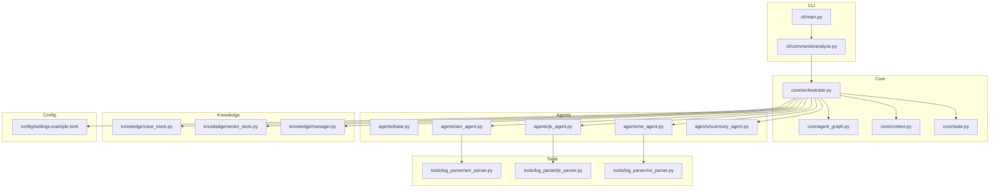
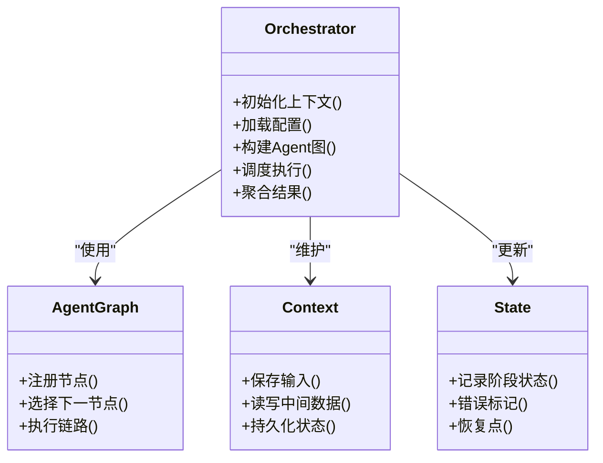
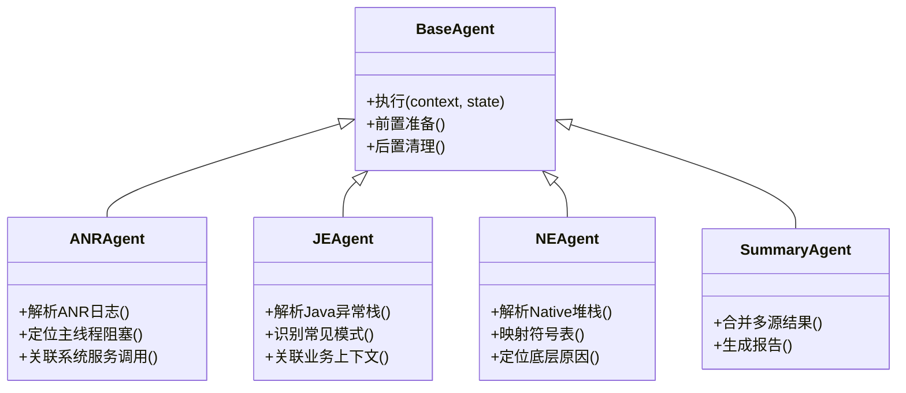
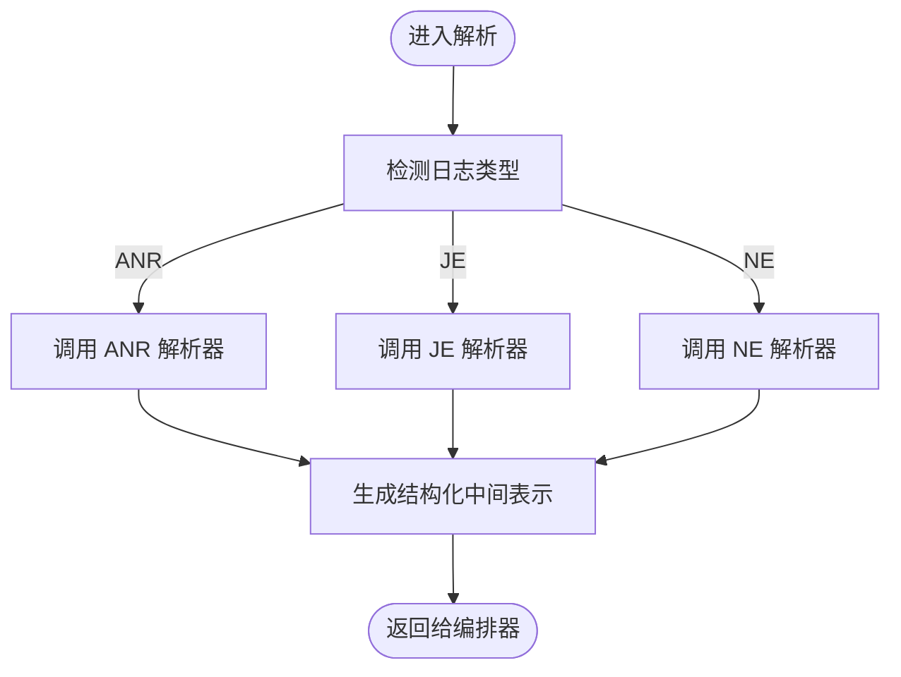
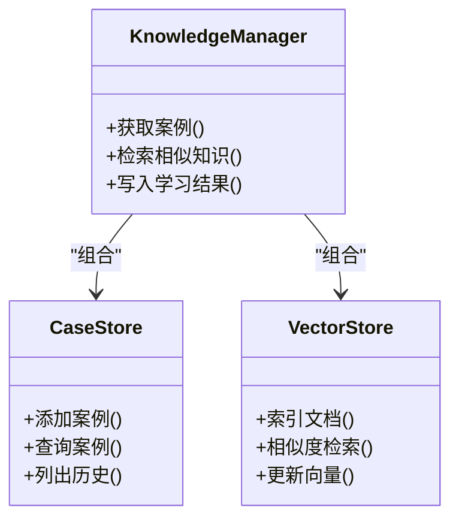
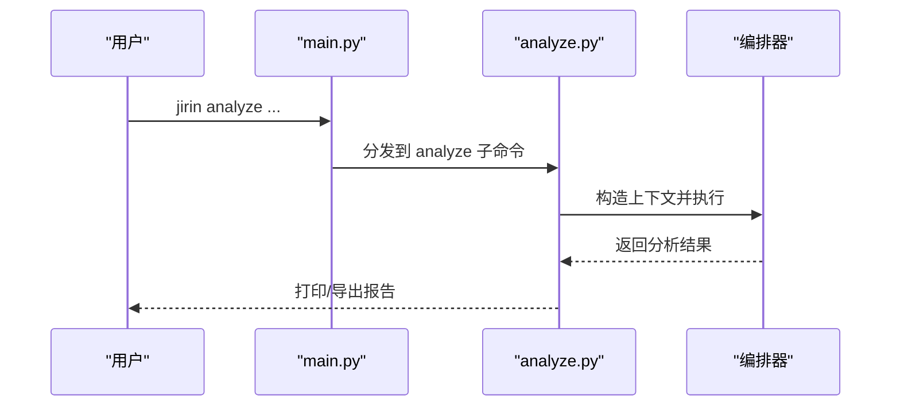
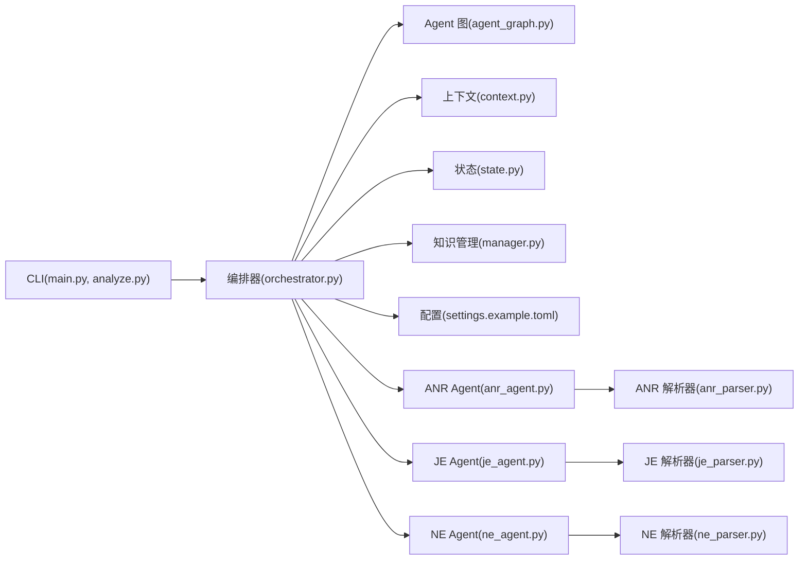

# 项目概述

<cite>
**本文引用的文件**   
- [pyproject.toml](file://pyproject.toml)
- [src/jirin/__init__.py](file://src/jirin/__init__.py)
- [src/jirin/cli/main.py](file://src/jirin/cli/main.py)
- [src/jirin/cli/commands/analyze.py](file://src/jirin/cli/commands/analyze.py)
- [src/jirin/core/orchestrator.py](file://src/jirin/core/orchestrator.py)
- [src/jirin/core/agent_graph.py](file://src/jirin/core/agent_graph.py)
- [src/jirin/core/context.py](file://src/jirin/core/context.py)
- [src/jirin/core/state.py](file://src/jirin/core/state.py)
- [src/jirin/agents/base.py](file://src/jirin/agents/base.py)
- [src/jirin/agents/anr_agent.py](file://src/jirin/agents/anr_agent.py)
- [src/jirin/agents/je_agent.py](file://src/jirin/agents/je_agent.py)
- [src/jirin/agents/ne_agent.py](file://src/jirin/agents/ne_agent.py)
- [src/jirin/agents/summary_agent.py](file://src/jirin/agents/summary_agent.py)
- [src/jirin/tools/log_parser/anr_parser.py](file://src/jirin/tools/log_parser/anr_parser.py)
- [src/jirin/tools/log_parser/je_parser.py](file://src/jirin/tools/log_parser/je_parser.py)
- [src/jirin/tools/log_parser/ne_parser.py](file://src/jirin/tools/log_parser/ne_parser.py)
- [src/jirin/knowledge/case_store.py](file://src/jirin/knowledge/case_store.py)
- [src/jirin/knowledge/vector_store.py](file://src/jirin/knowledge/vector_store.py)
- [src/jirin/knowledge/manager.py](file://src/jirin/knowledge/manager.py)
- [config/settings.example.toml](file://config/settings.example.toml)
</cite>

## 目录
1. [简介](#简介)
2. [项目结构](#项目结构)
3. [核心组件](#核心组件)
4. [架构总览](#架构总览)
5. [详细组件分析](#详细组件分析)
6. [依赖关系分析](#依赖关系分析)
7. [性能与可扩展性](#性能与可扩展性)
8. [故障排查指南](#故障排查指南)
9. [结论](#结论)
10. [附录：快速开始](#附录快速开始)

## 简介
Jirin 是一个面向 Android 的崩溃智能分析系统，聚焦于 ANR、Java 异常（JE）与 Native 崩溃（NE）三大类问题的自动化诊断。其核心价值在于通过“Agent 协作模式”将日志解析、知识检索、推理编排与报告生成串联起来，显著降低定位复杂问题的门槛与时间成本。

主要特性
- 多类型崩溃统一入口：ANR、Java 异常、Native 崩溃一站式分析
- Agent 协作式编排：按问题类型自动路由到对应专家 Agent，并汇总输出
- 知识与记忆增强：案例库与向量知识库辅助相似问题匹配与经验复用
- 可插拔工具链：日志解析器、设备交互、代码搜索等模块解耦扩展
- 工程化集成：CLI 命令驱动，便于接入 CI/CD 与日常调试流程

适用场景
- 线上崩溃复现困难时的离线日志分析
- 团队沉淀问题经验，形成可检索的知识资产
- 在持续集成中自动产出崩溃分析报告，提升回归效率

## 项目结构
仓库采用分层与领域混合组织方式：
- CLI 层：提供命令行入口与子命令
- Core 层：编排器、状态机、上下文与 Agent 图
- Agents 层：各类型崩溃的专家 Agent
- Tools 层：日志解析、设备交互、代码搜索等工具
- Knowledge 层：案例存储、向量存储与知识管理
- Config 层：配置项示例与默认设置



图表来源
- [src/jirin/cli/main.py](file://src/jirin/cli/main.py)
- [src/jirin/cli/commands/analyze.py](file://src/jirin/cli/commands/analyze.py)
- [src/jirin/core/orchestrator.py](file://src/jirin/core/orchestrator.py)
- [src/jirin/core/agent_graph.py](file://src/jirin/core/agent_graph.py)
- [src/jirin/core/context.py](file://src/jirin/core/context.py)
- [src/jirin/core/state.py](file://src/jirin/core/state.py)
- [src/jirin/agents/base.py](file://src/jirin/agents/base.py)
- [src/jirin/agents/anr_agent.py](file://src/jirin/agents/anr_agent.py)
- [src/jirin/agents/je_agent.py](file://src/jirin/agents/je_agent.py)
- [src/jirin/agents/ne_agent.py](file://src/jirin/agents/ne_agent.py)
- [src/jirin/agents/summary_agent.py](file://src/jirin/agents/summary_agent.py)
- [src/jirin/tools/log_parser/anr_parser.py](file://src/jirin/tools/log_parser/anr_parser.py)
- [src/jirin/tools/log_parser/je_parser.py](file://src/jirin/tools/log_parser/je_parser.py)
- [src/jirin/tools/log_parser/ne_parser.py](file://src/jirin/tools/log_parser/ne_parser.py)
- [src/jirin/knowledge/case_store.py](file://src/jirin/knowledge/case_store.py)
- [src/jirin/knowledge/vector_store.py](file://src/jirin/knowledge/vector_store.py)
- [src/jirin/knowledge/manager.py](file://src/jirin/knowledge/manager.py)
- [config/settings.example.toml](file://config/settings.example.toml)

章节来源
- [pyproject.toml](file://pyproject.toml)
- [src/jirin/__init__.py](file://src/jirin/__init__.py)
- [src/jirin/cli/main.py](file://src/jirin/cli/main.py)
- [src/jirin/cli/commands/analyze.py](file://src/jirin/cli/commands/analyze.py)
- [src/jirin/core/orchestrator.py](file://src/jirin/core/orchestrator.py)
- [src/jirin/core/agent_graph.py](file://src/jirin/core/agent_graph.py)
- [src/jirin/core/context.py](file://src/jirin/core/context.py)
- [src/jirin/core/state.py](file://src/jirin/core/state.py)
- [src/jirin/agents/base.py](file://src/jirin/agents/base.py)
- [src/jirin/agents/anr_agent.py](file://src/jirin/agents/anr_agent.py)
- [src/jirin/agents/je_agent.py](file://src/jirin/agents/je_agent.py)
- [src/jirin/agents/ne_agent.py](file://src/jirin/agents/ne_agent.py)
- [src/jirin/agents/summary_agent.py](file://src/jirin/agents/summary_agent.py)
- [src/jirin/tools/log_parser/anr_parser.py](file://src/jirin/tools/log_parser/anr_parser.py)
- [src/jirin/tools/log_parser/je_parser.py](file://src/jirin/tools/log_parser/je_parser.py)
- [src/jirin/tools/log_parser/ne_parser.py](file://src/jirin/tools/log_parser/ne_parser.py)
- [src/jirin/knowledge/case_store.py](file://src/jirin/knowledge/case_store.py)
- [src/jirin/knowledge/vector_store.py](file://src/jirin/knowledge/vector_store.py)
- [src/jirin/knowledge/manager.py](file://src/jirin/knowledge/manager.py)
- [config/settings.example.toml](file://config/settings.example.toml)

## 核心组件
- 编排器（Orchestrator）：负责加载配置、构建 Agent 图、维护执行上下文与状态，协调各 Agent 的顺序与分支逻辑。
- Agent 基类与专家 Agent：定义统一的 Agent 接口与生命周期；ANR/JE/NE/Summary 等具体 Agent 实现各自的分析策略。
- 日志解析器：针对 ANR/JE/NE 三类崩溃日志进行结构化抽取，为上层 Agent 提供标准化输入。
- 知识管理：案例库与向量知识库支撑相似问题检索与经验复用，Manager 提供统一访问入口。
- CLI 命令：analyze 命令作为用户入口，接收输入路径、选择分析类型、触发编排流程并输出结果。

章节来源
- [src/jirin/core/orchestrator.py](file://src/jirin/core/orchestrator.py)
- [src/jirin/core/agent_graph.py](file://src/jirin/core/agent_graph.py)
- [src/jirin/core/context.py](file://src/jirin/core/context.py)
- [src/jirin/core/state.py](file://src/jirin/core/state.py)
- [src/jirin/agents/base.py](file://src/jirin/agents/base.py)
- [src/jirin/agents/anr_agent.py](file://src/jirin/agents/anr_agent.py)
- [src/jirin/agents/je_agent.py](file://src/jirin/agents/je_agent.py)
- [src/jirin/agents/ne_agent.py](file://src/jirin/agents/ne_agent.py)
- [src/jirin/agents/summary_agent.py](file://src/jirin/agents/summary_agent.py)
- [src/jirin/tools/log_parser/anr_parser.py](file://src/jirin/tools/log_parser/anr_parser.py)
- [src/jirin/tools/log_parser/je_parser.py](file://src/jirin/tools/log_parser/je_parser.py)
- [src/jirin/tools/log_parser/ne_parser.py](file://src/jirin/tools/log_parser/ne_parser.py)
- [src/jirin/knowledge/case_store.py](file://src/jirin/knowledge/case_store.py)
- [src/jirin/knowledge/vector_store.py](file://src/jirin/knowledge/vector_store.py)
- [src/jirin/knowledge/manager.py](file://src/jirin/knowledge/manager.py)
- [src/jirin/cli/commands/analyze.py](file://src/jirin/cli/commands/analyze.py)

## 架构总览
Jirin 以“编排器 + Agent 图”为核心，结合“日志解析器 + 知识管理”，形成从输入到输出的端到端流水线。

```mermaid
sequenceDiagram
participant U as "用户"
participant CLI as "analyze 命令"
participant ORC as "编排器"
participant AG as "Agent 图"
participant PAR as "日志解析器"
participant EXP as "专家 Agent(ANR/JE/NE)"
participant SUM as "总结 Agent"
participant KNOW as "知识管理"
U->>CLI : 传入日志路径与分析类型
CLI->>ORC : 初始化上下文与参数
ORC->>AG : 构建/加载 Agent 图
ORC->>PAR : 解析原始日志
PAR-->>ORC : 结构化中间表示
ORC->>EXP : 路由至对应专家 Agent
EXP->>KNOW : 检索相似案例/向量知识
KNOW-->>EXP : 返回候选知识
EXP-->>ORC : 分析结果片段
ORC->>SUM : 汇总与格式化
SUM-->>U : 输出分析报告
```

图表来源
- [src/jirin/cli/commands/analyze.py](file://src/jirin/cli/commands/analyze.py)
- [src/jirin/core/orchestrator.py](file://src/jirin/core/orchestrator.py)
- [src/jirin/core/agent_graph.py](file://src/jirin/core/agent_graph.py)
- [src/jirin/tools/log_parser/anr_parser.py](file://src/jirin/tools/log_parser/anr_parser.py)
- [src/jirin/tools/log_parser/je_parser.py](file://src/jirin/tools/log_parser/je_parser.py)
- [src/jirin/tools/log_parser/ne_parser.py](file://src/jirin/tools/log_parser/ne_parser.py)
- [src/jirin/agents/anr_agent.py](file://src/jirin/agents/anr_agent.py)
- [src/jirin/agents/je_agent.py](file://src/jirin/agents/je_agent.py)
- [src/jirin/agents/ne_agent.py](file://src/jirin/agents/ne_agent.py)
- [src/jirin/agents/summary_agent.py](file://src/jirin/agents/summary_agent.py)
- [src/jirin/knowledge/manager.py](file://src/jirin/knowledge/manager.py)

## 详细组件分析

### 编排器与 Agent 图
- 编排器负责：
  - 读取配置与环境参数
  - 创建并维护执行上下文与状态
  - 根据输入类型选择并调度相应 Agent
  - 聚合各阶段结果并驱动总结 Agent
- Agent 图用于描述节点间的连接与流转规则，支持条件分支与并行扩展。



图表来源
- [src/jirin/core/orchestrator.py](file://src/jirin/core/orchestrator.py)
- [src/jirin/core/agent_graph.py](file://src/jirin/core/agent_graph.py)
- [src/jirin/core/context.py](file://src/jirin/core/context.py)
- [src/jirin/core/state.py](file://src/jirin/core/state.py)

章节来源
- [src/jirin/core/orchestrator.py](file://src/jirin/core/orchestrator.py)
- [src/jirin/core/agent_graph.py](file://src/jirin/core/agent_graph.py)
- [src/jirin/core/context.py](file://src/jirin/core/context.py)
- [src/jirin/core/state.py](file://src/jirin/core/state.py)

### 专家 Agent 体系
- 基类定义统一接口与生命周期钩子，确保不同 Agent 具备一致的输入/输出契约。
- ANR/JE/NE 三个专业 Agent 分别处理对应类型的崩溃日志，调用相应解析器并基于知识进行推理。
- Summary Agent 负责汇总各专家结果，生成可读性强的最终报告。



图表来源
- [src/jirin/agents/base.py](file://src/jirin/agents/base.py)
- [src/jirin/agents/anr_agent.py](file://src/jirin/agents/anr_agent.py)
- [src/jirin/agents/je_agent.py](file://src/jirin/agents/je_agent.py)
- [src/jirin/agents/ne_agent.py](file://src/jirin/agents/ne_agent.py)
- [src/jirin/agents/summary_agent.py](file://src/jirin/agents/summary_agent.py)

章节来源
- [src/jirin/agents/base.py](file://src/jirin/agents/base.py)
- [src/jirin/agents/anr_agent.py](file://src/jirin/agents/anr_agent.py)
- [src/jirin/agents/je_agent.py](file://src/jirin/agents/je_agent.py)
- [src/jirin/agents/ne_agent.py](file://src/jirin/agents/ne_agent.py)
- [src/jirin/agents/summary_agent.py](file://src/jirin/agents/summary_agent.py)

### 日志解析器
- ANR 解析器：提取主线程堆栈、系统服务调用、锁竞争线索等关键信息。
- JE 解析器：规范化 Java 异常栈，识别常见异常模式与抛出点。
- NE 解析器：解析 Native 崩溃堆栈，配合符号映射定位底层问题。



图表来源
- [src/jirin/tools/log_parser/anr_parser.py](file://src/jirin/tools/log_parser/anr_parser.py)
- [src/jirin/tools/log_parser/je_parser.py](file://src/jirin/tools/log_parser/je_parser.py)
- [src/jirin/tools/log_parser/ne_parser.py](file://src/jirin/tools/log_parser/ne_parser.py)

章节来源
- [src/jirin/tools/log_parser/anr_parser.py](file://src/jirin/tools/log_parser/anr_parser.py)
- [src/jirin/tools/log_parser/je_parser.py](file://src/jirin/tools/log_parser/je_parser.py)
- [src/jirin/tools/log_parser/ne_parser.py](file://src/jirin/tools/log_parser/ne_parser.py)

### 知识管理与案例库
- Case Store：本地案例存储，支持新增、查询与版本化管理。
- Vector Store：向量知识库，用于语义相似度检索与经验复用。
- Manager：统一封装对案例与向量的访问，供 Agent 按需调用。



图表来源
- [src/jirin/knowledge/case_store.py](file://src/jirin/knowledge/case_store.py)
- [src/jirin/knowledge/vector_store.py](file://src/jirin/knowledge/vector_store.py)
- [src/jirin/knowledge/manager.py](file://src/jirin/knowledge/manager.py)

章节来源
- [src/jirin/knowledge/case_store.py](file://src/jirin/knowledge/case_store.py)
- [src/jirin/knowledge/vector_store.py](file://src/jirin/knowledge/vector_store.py)
- [src/jirin/knowledge/manager.py](file://src/jirin/knowledge/manager.py)

### CLI 入口与 analyze 命令
- main.py 提供顶层 CLI 入口，注册子命令与全局参数。
- analyze 命令负责解析用户参数、校验输入、调用编排器执行分析并输出结果。



图表来源
- [src/jirin/cli/main.py](file://src/jirin/cli/main.py)
- [src/jirin/cli/commands/analyze.py](file://src/jirin/cli/commands/analyze.py)
- [src/jirin/core/orchestrator.py](file://src/jirin/core/orchestrator.py)

章节来源
- [src/jirin/cli/main.py](file://src/jirin/cli/main.py)
- [src/jirin/cli/commands/analyze.py](file://src/jirin/cli/commands/analyze.py)

## 依赖关系分析
- 内部依赖
  - CLI 依赖编排器与 Agent 图
  - 编排器依赖上下文、状态、Agent 集合与知识管理
  - 专家 Agent 依赖对应日志解析器与知识管理
- 外部依赖
  - 配置文件由 settings.example.toml 提供示例键值，运行时由编排器加载
  - 第三方库由 pyproject.toml 声明



图表来源
- [src/jirin/cli/main.py](file://src/jirin/cli/main.py)
- [src/jirin/cli/commands/analyze.py](file://src/jirin/cli/commands/analyze.py)
- [src/jirin/core/orchestrator.py](file://src/jirin/core/orchestrator.py)
- [src/jirin/core/agent_graph.py](file://src/jirin/core/agent_graph.py)
- [src/jirin/core/context.py](file://src/jirin/core/context.py)
- [src/jirin/core/state.py](file://src/jirin/core/state.py)
- [src/jirin/agents/anr_agent.py](file://src/jirin/agents/anr_agent.py)
- [src/jirin/agents/je_agent.py](file://src/jirin/agents/je_agent.py)
- [src/jirin/agents/ne_agent.py](file://src/jirin/agents/ne_agent.py)
- [src/jirin/tools/log_parser/anr_parser.py](file://src/jirin/tools/log_parser/anr_parser.py)
- [src/jirin/tools/log_parser/je_parser.py](file://src/jirin/tools/log_parser/je_parser.py)
- [src/jirin/tools/log_parser/ne_parser.py](file://src/jirin/tools/log_parser/ne_parser.py)
- [src/jirin/knowledge/manager.py](file://src/jirin/knowledge/manager.py)
- [config/settings.example.toml](file://config/settings.example.toml)
- [pyproject.toml](file://pyproject.toml)

章节来源
- [pyproject.toml](file://pyproject.toml)
- [src/jirin/cli/main.py](file://src/jirin/cli/main.py)
- [src/jirin/cli/commands/analyze.py](file://src/jirin/cli/commands/analyze.py)
- [src/jirin/core/orchestrator.py](file://src/jirin/core/orchestrator.py)
- [src/jirin/core/agent_graph.py](file://src/jirin/core/agent_graph.py)
- [src/jirin/core/context.py](file://src/jirin/core/context.py)
- [src/jirin/core/state.py](file://src/jirin/core/state.py)
- [src/jirin/agents/anr_agent.py](file://src/jirin/agents/anr_agent.py)
- [src/jirin/agents/je_agent.py](file://src/jirin/agents/je_agent.py)
- [src/jirin/agents/ne_agent.py](file://src/jirin/agents/ne_agent.py)
- [src/jirin/tools/log_parser/anr_parser.py](file://src/jirin/tools/log_parser/anr_parser.py)
- [src/jirin/tools/log_parser/je_parser.py](file://src/jirin/tools/log_parser/je_parser.py)
- [src/jirin/tools/log_parser/ne_parser.py](file://src/jirin/tools/log_parser/ne_parser.py)
- [src/jirin/knowledge/manager.py](file://src/jirin/knowledge/manager.py)
- [config/settings.example.toml](file://config/settings.example.toml)

## 性能与可扩展性
- 模块化设计：解析器与 Agent 解耦，便于替换或并行执行
- 知识检索优化：向量库索引与缓存可减少重复计算
- 增量分析：基于状态机的检查点与恢复能力，避免全量重算
- 可扩展点：新增崩溃类型只需实现新 Agent 与解析器，并在 Agent 图中注册

[本节为通用指导，不直接分析具体文件]

## 故障排查指南
- 常见问题
  - 日志路径无效或权限不足：确认输入路径存在且可读
  - 配置缺失或不合法：参考示例配置补齐必要键值
  - 解析失败：检查日志格式是否符合预期类型
  - 知识检索为空：确认知识库已初始化并包含相关条目
- 建议步骤
  - 启用更详细的运行日志
  - 分步验证：先单独运行解析器，再逐步引入 Agent
  - 回退到最小可用配置，逐步增加复杂度定位问题

章节来源
- [src/jirin/core/orchestrator.py](file://src/jirin/core/orchestrator.py)
- [src/jirin/core/state.py](file://src/jirin/core/state.py)
- [config/settings.example.toml](file://config/settings.example.toml)

## 结论
Jirin 通过“编排器 + Agent 图 + 知识管理”的架构，将 Android 崩溃分析从手工经验驱动升级为系统化、可复用的自动化流程。其清晰的模块边界与可扩展的设计，使其既能满足初学者快速上手的需求，也能支撑资深开发者深度定制与集成。

[本节为总结性内容，不直接分析具体文件]

## 附录：快速开始
- 安装与准备
  - 克隆仓库并进入项目根目录
  - 依据 pyproject.toml 中的依赖说明安装运行环境
  - 复制 config/settings.example.toml 为实际配置文件，并按需调整
- 首次分析
  - 使用 analyze 命令指定日志路径与分析类型（如 ANR/JE/NE）
  - 观察控制台输出与生成的报告文件
- 进阶用法
  - 将分析纳入 CI/CD 流水线，定期扫描日志并归档报告
  - 向案例库与向量知识库补充历史问题，提升后续分析准确率

章节来源
- [pyproject.toml](file://pyproject.toml)
- [config/settings.example.toml](file://config/settings.example.toml)
- [src/jirin/cli/commands/analyze.py](file://src/jirin/cli/commands/analyze.py)