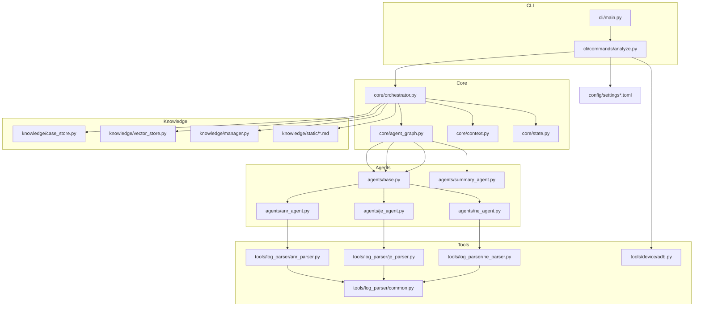
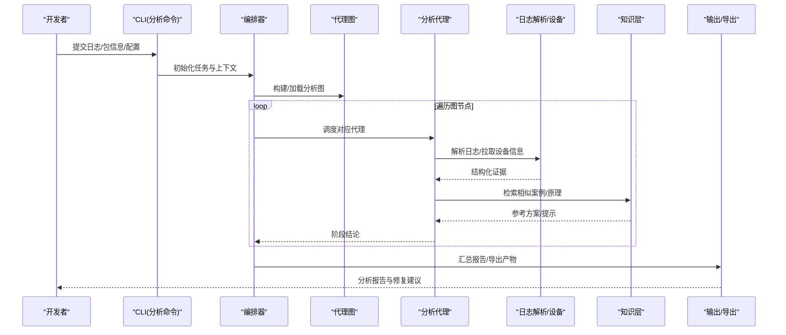
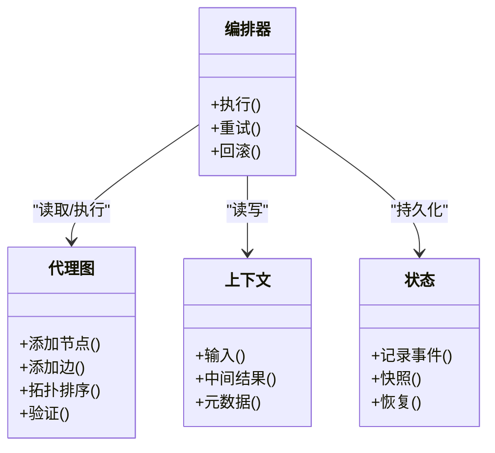
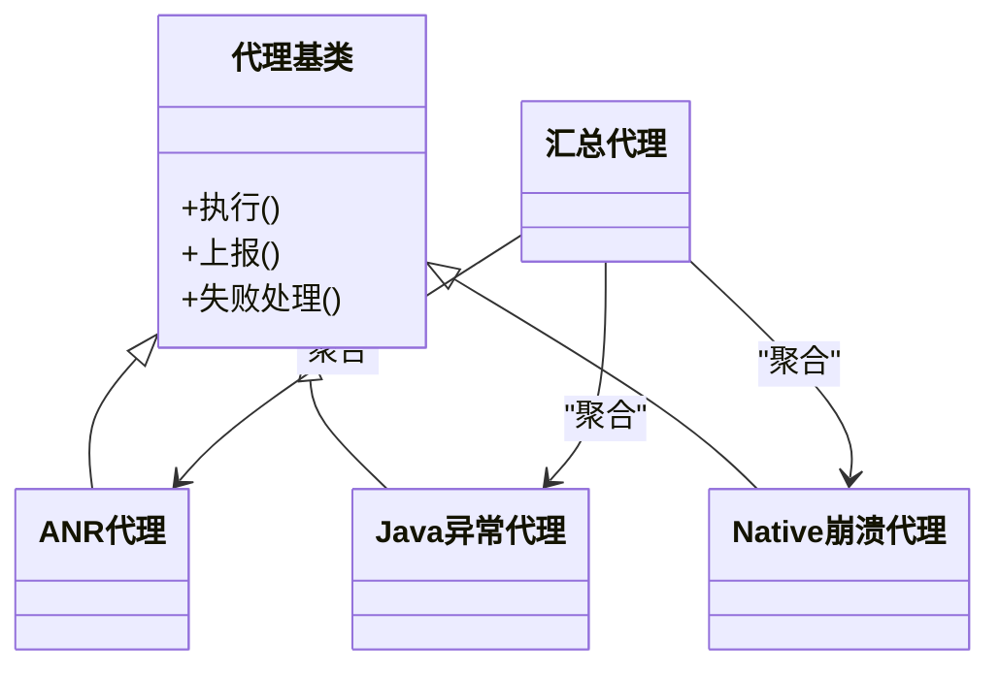
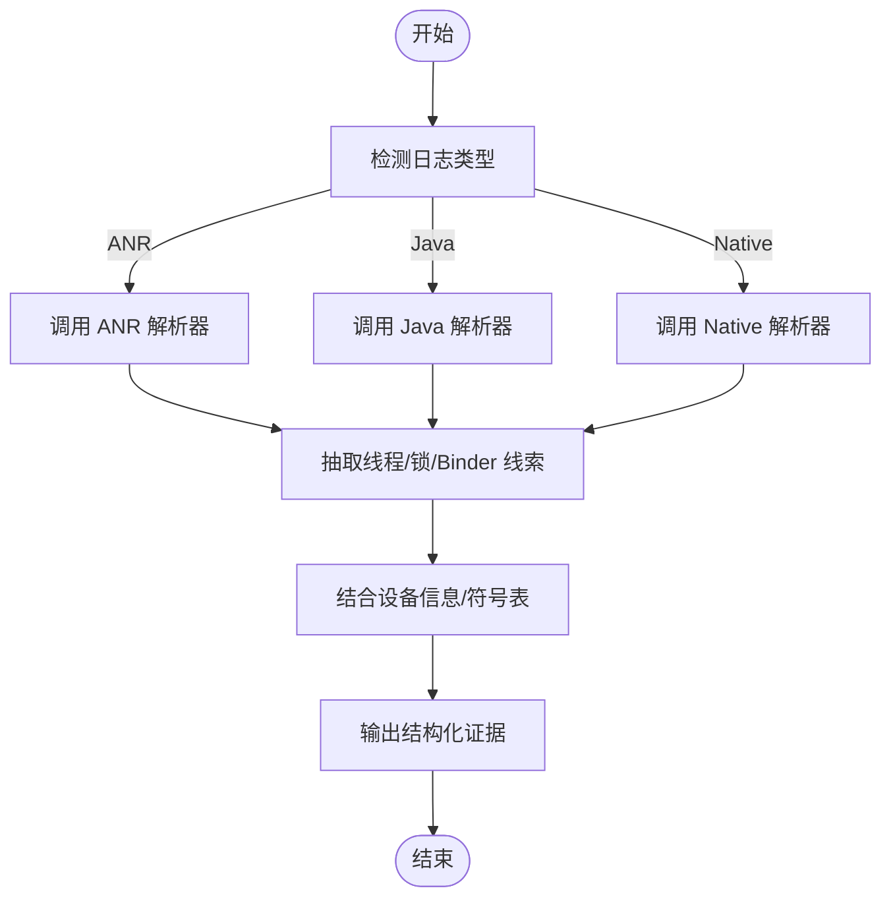
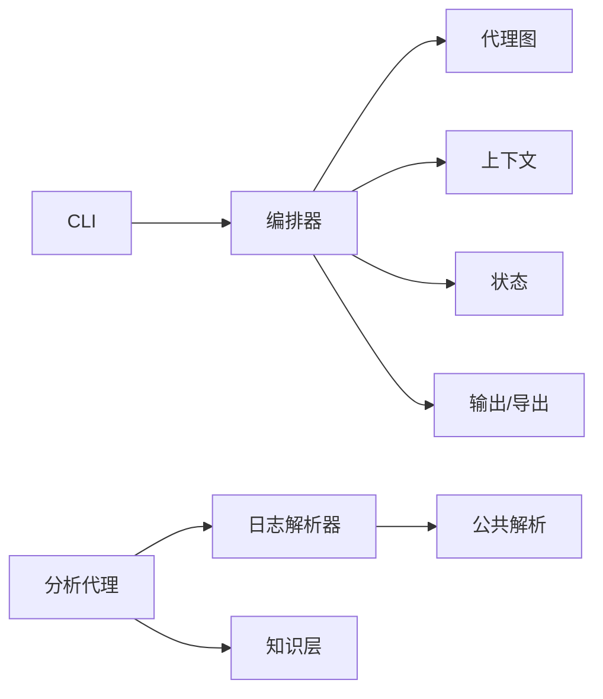

# 项目简介与核心价值

<cite>
**本文引用的文件**   
- [pyproject.toml](file://pyproject.toml)
- [settings.example.toml](file://config/settings.example.toml)
- [settings.toml](file://config/settings.toml)
- [main.py](file://src/jirin/cli/main.py)
- [analyze.py](file://src/jirin/cli/commands/analyze.py)
- [agent_graph.py](file://src/jirin/core/agent_graph.py)
- [orchestrator.py](file://src/jirin/core/orchestrator.py)
- [context.py](file://src/jirin/core/context.py)
- [state.py](file://src/jirin/core/state.py)
- [anr_agent.py](file://src/jirin/agents/anr_agent.py)
- [je_agent.py](file://src/jirin/agents/je_agent.py)
- [ne_agent.py](file://src/jirin/agents/ne_agent.py)
- [summary_agent.py](file://src/jirin/agents/summary_agent.py)
- [base.py](file://src/jirin/agents/base.py)
- [anr_parser.py](file://src/jirin/tools/log_parser/anr_parser.py)
- [je_parser.py](file://src/jirin/tools/log_parser/je_parser.py)
- [ne_parser.py](file://src/jirin/tools/log_parser/ne_parser.py)
- [common.py](file://src/jirin/tools/log_parser/common.py)
- [adb.py](file://src/jirin/tools/device/adb.py)
- [case_store.py](file://src/jirin/knowledge/case_store.py)
- [manager.py](file://src/jirin/knowledge/manager.py)
- [vector_store.py](file://src/jirin/knowledge/vector_store.py)
- [analysis_flow.md](file://src/jirin/knowledge/static/analysis_flow.md)
- [anr_principles.md](file://src/jirin/knowledge/static/anr_principles.md)
- [je_principles.md](file://src/jirin/knowledge/static/je_principles.md)
- [ne_principles.md](file://src/jirin/knowledge/static/ne_principles.md)
</cite>

## 目录
1. [引言](#引言)
2. [项目结构](#项目结构)
3. [核心组件](#核心组件)
4. [架构总览](#架构总览)
5. [详细组件分析](#详细组件分析)
6. [依赖分析](#依赖分析)
7. [性能考量](#性能考量)
8. [故障排查指南](#故障排查指南)
9. [结论](#结论)
10. [附录](#附录)

## 引言
Jirin 是一个面向 Android 的崩溃与卡顿诊断系统，聚焦于三大痛点：ANR（应用无响应）自动检测与分析、Java 异常智能诊断、Native 崩溃深度解析。它通过“可编排的分析代理”和“知识增强”的方式，将碎片化的日志、堆栈与上下文信息整合为可执行的修复建议，显著缩短从问题复现到根因定位的时间。

在 Android 开发生命周期中，Jirin 定位于“离线+在线”的调试辅助层：既可在本地对导出日志进行批处理分析，也可结合设备侧工具链快速采集现场数据。其设计理念强调“低侵入、高扩展、强可解释”，以最小改动融入现有 CI/CD 与日常调试流程，帮助团队建立稳定的质量闭环。

## 项目结构
仓库采用按职责分层与按领域聚合相结合的布局：
- CLI 入口与命令：提供统一命令行接口，覆盖分析、配置、导出、学习等能力
- 核心编排：基于图结构的代理编排器、运行时上下文与状态管理
- 分析代理：针对 ANR、Java 异常、Native 崩溃的专用 Agent，以及汇总 Agent
- 工具层：日志解析、设备交互（ADB）、代码搜索
- 知识层：案例库、向量检索与静态原理文档
- 配置与数据：示例配置、导出与内存缓存占位

图表来源
- [main.py:1-200](file://src/jirin/cli/main.py#L1-L200)
- [analyze.py:1-200](file://src/jirin/cli/commands/analyze.py#L1-L200)
- [agent_graph.py:1-200](file://src/jirin/core/agent_graph.py#L1-L200)
- [orchestrator.py:1-200](file://src/jirin/core/orchestrator.py#L1-L200)
- [context.py:1-200](file://src/jirin/core/context.py#L1-L200)
- [state.py:1-200](file://src/jirin/core/state.py#L1-L200)
- [base.py:1-200](file://src/jirin/agents/base.py#L1-L200)
- [anr_agent.py:1-200](file://src/jirin/agents/anr_agent.py#L1-L200)
- [je_agent.py:1-200](file://src/jirin/agents/je_agent.py#L1-L200)
- [ne_agent.py:1-200](file://src/jirin/agents/ne_agent.py#L1-L200)
- [summary_agent.py:1-200](file://src/jirin/agents/summary_agent.py#L1-L200)
- [anr_parser.py:1-200](file://src/jirin/tools/log_parser/anr_parser.py#L1-L200)
- [je_parser.py:1-200](file://src/jirin/tools/log_parser/je_parser.py#L1-L200)
- [ne_parser.py:1-200](file://src/jirin/tools/log_parser/ne_parser.py#L1-L200)
- [common.py:1-200](file://src/jirin/tools/log_parser/common.py#L1-L200)
- [adb.py:1-200](file://src/jirin/tools/device/adb.py#L1-L200)
- [case_store.py:1-200](file://src/jirin/knowledge/case_store.py#L1-L200)
- [vector_store.py:1-200](file://src/jirin/knowledge/vector_store.py#L1-L200)
- [manager.py:1-200](file://src/jirin/knowledge/manager.py#L1-L200)
- [analysis_flow.md:1-200](file://src/jirin/knowledge/static/analysis_flow.md#L1-L200)
- [anr_principles.md:1-200](file://src/jirin/knowledge/static/anr_principles.md#L1-L200)
- [je_principles.md:1-200](file://src/jirin/knowledge/static/je_principles.md#L1-L200)
- [ne_principles.md:1-200](file://src/jirin/knowledge/static/ne_principles.md#L1-L200)

章节来源
- [pyproject.toml:1-200](file://pyproject.toml#L1-L200)
- [settings.example.toml:1-200](file://config/settings.example.toml#L1-L200)
- [settings.toml:1-200](file://config/settings.toml#L1-L200)

## 核心组件
- 命令行入口与命令
  - 提供统一的 CLI 入口与 analyze 命令，负责参数解析、配置加载、任务调度与结果输出
  - 支持导出与学习等扩展命令，便于集成到工作流
- 核心编排与状态
  - 基于图结构的代理编排器，定义节点与边，驱动执行顺序与分支
  - 运行期上下文与状态对象贯穿整个分析链路，保证数据一致性与可追溯性
- 分析代理族
  - ANR 代理：解析主线程阻塞、Looper 消息队列、Binder 超时等线索
  - Java 异常代理：识别常见异常模式、关联调用栈与资源占用
  - Native 崩溃代理：解析信号、堆栈、模块映射与符号表
  - 汇总代理：综合各代理结论，生成结构化报告与修复建议
- 工具层
  - 日志解析器：针对 ANR、Java、Native 三类日志的结构化抽取
  - 设备交互：通过 ADB 拉取日志、进程信息与崩溃转储
  - 代码搜索：结合源码映射提升定位效率
- 知识层
  - 案例库与向量检索：沉淀历史问题与解决方案，支持相似问题推荐
  - 静态原理文档：ANR/Java/Native 的原理说明与分析流程指引

章节来源
- [main.py:1-200](file://src/jirin/cli/main.py#L1-L200)
- [analyze.py:1-200](file://src/jirin/cli/commands/analyze.py#L1-L200)
- [agent_graph.py:1-200](file://src/jirin/core/agent_graph.py#L1-L200)
- [orchestrator.py:1-200](file://src/jirin/core/orchestrator.py#L1-L200)
- [context.py:1-200](file://src/jirin/core/context.py#L1-L200)
- [state.py:1-200](file://src/jirin/core/state.py#L1-L200)
- [base.py:1-200](file://src/jirin/agents/base.py#L1-L200)
- [anr_agent.py:1-200](file://src/jirin/agents/anr_agent.py#L1-L200)
- [je_agent.py:1-200](file://src/jirin/agents/je_agent.py#L1-L200)
- [ne_agent.py:1-200](file://src/jirin/agents/ne_agent.py#L1-L200)
- [summary_agent.py:1-200](file://src/jirin/agents/summary_agent.py#L1-L200)
- [anr_parser.py:1-200](file://src/jirin/tools/log_parser/anr_parser.py#L1-L200)
- [je_parser.py:1-200](file://src/jirin/tools/log_parser/je_parser.py#L1-L200)
- [ne_parser.py:1-200](file://src/jirin/tools/log_parser/ne_parser.py#L1-L200)
- [common.py:1-200](file://src/jirin/tools/log_parser/common.py#L1-L200)
- [adb.py:1-200](file://src/jirin/tools/device/adb.py#L1-L200)
- [case_store.py:1-200](file://src/jirin/knowledge/case_store.py#L1-L200)
- [vector_store.py:1-200](file://src/jirin/knowledge/vector_store.py#L1-L200)
- [manager.py:1-200](file://src/jirin/knowledge/manager.py#L1-L200)

## 架构总览
Jirin 的整体架构围绕“命令驱动—编排执行—代理分析—知识增强—结果输出”的主循环展开。CLI 接收输入并构建任务；编排器根据图结构调度代理；代理调用解析器与外部工具获取证据；知识层提供背景与相似案例；最终由汇总代理产出报告。

图表来源
- [main.py:1-200](file://src/jirin/cli/main.py#L1-L200)
- [analyze.py:1-200](file://src/jirin/cli/commands/analyze.py#L1-L200)
- [orchestrator.py:1-200](file://src/jirin/core/orchestrator.py#L1-L200)
- [agent_graph.py:1-200](file://src/jirin/core/agent_graph.py#L1-L200)
- [anr_agent.py:1-200](file://src/jirin/agents/anr_agent.py#L1-L200)
- [je_agent.py:1-200](file://src/jirin/agents/je_agent.py#L1-L200)
- [ne_agent.py:1-200](file://src/jirin/agents/ne_agent.py#L1-L200)
- [summary_agent.py:1-200](file://src/jirin/agents/summary_agent.py#L1-L200)
- [anr_parser.py:1-200](file://src/jirin/tools/log_parser/anr_parser.py#L1-L200)
- [je_parser.py:1-200](file://src/jirin/tools/log_parser/je_parser.py#L1-L200)
- [ne_parser.py:1-200](file://src/jirin/tools/log_parser/ne_parser.py#L1-L200)
- [adb.py:1-200](file://src/jirin/tools/device/adb.py#L1-L200)
- [case_store.py:1-200](file://src/jirin/knowledge/case_store.py#L1-L200)
- [vector_store.py:1-200](file://src/jirin/knowledge/vector_store.py#L1-L200)
- [manager.py:1-200](file://src/jirin/knowledge/manager.py#L1-L200)

## 详细组件分析

### 命令行与配置
- 作用
  - 提供统一的 CLI 入口，封装分析、配置、导出、学习等子命令
  - 读取配置文件，注入到运行期上下文，控制分析策略与输出格式
- 关键路径
  - 入口与命令注册：[main.py](file://src/jirin/cli/main.py)
  - 分析命令实现：[analyze.py](file://src/jirin/cli/commands/analyze.py)
  - 配置模板与实际配置：[settings.example.toml](file://config/settings.example.toml), [settings.toml](file://config/settings.toml)

章节来源
- [main.py:1-200](file://src/jirin/cli/main.py#L1-L200)
- [analyze.py:1-200](file://src/jirin/cli/commands/analyze.py#L1-L200)
- [settings.example.toml:1-200](file://config/settings.example.toml#L1-L200)
- [settings.toml:1-200](file://config/settings.toml#L1-L200)

### 核心编排与状态
- 作用
  - 代理图：声明式定义分析步骤、依赖关系与条件分支
  - 编排器：按拓扑顺序执行节点，维护执行上下文与中间结果
  - 上下文与状态：贯穿全链路的共享数据载体，确保可观测与可回放
- 关键路径
  - 代理图：[agent_graph.py](file://src/jirin/core/agent_graph.py)
  - 编排器：[orchestrator.py](file://src/jirin/core/orchestrator.py)
  - 上下文：[context.py](file://src/jirin/core/context.py)
  - 状态：[state.py](file://src/jirin/core/state.py)

图表来源
- [agent_graph.py:1-200](file://src/jirin/core/agent_graph.py#L1-L200)
- [orchestrator.py:1-200](file://src/jirin/core/orchestrator.py#L1-L200)
- [context.py:1-200](file://src/jirin/core/context.py#L1-L200)
- [state.py:1-200](file://src/jirin/core/state.py#L1-L200)

章节来源
- [agent_graph.py:1-200](file://src/jirin/core/agent_graph.py#L1-L200)
- [orchestrator.py:1-200](file://src/jirin/core/orchestrator.py#L1-L200)
- [context.py:1-200](file://src/jirin/core/context.py#L1-L200)
- [state.py:1-200](file://src/jirin/core/state.py#L1-L200)

### 分析代理族
- 设计要点
  - 基类抽象：统一生命周期、错误处理与结果上报
  - 领域代理：ANR/Java/Native 分别专注各自证据源与判定规则
  - 汇总代理：融合多代理结论，去重、冲突消解与优先级排序
- 关键路径
  - 基类：[base.py](file://src/jirin/agents/base.py)
  - ANR 代理：[anr_agent.py](file://src/jirin/agents/anr_agent.py)
  - Java 异常代理：[je_agent.py](file://src/jirin/agents/je_agent.py)
  - Native 崩溃代理：[ne_agent.py](file://src/jirin/agents/ne_agent.py)
  - 汇总代理：[summary_agent.py](file://src/jirin/agents/summary_agent.py)

图表来源
- [base.py:1-200](file://src/jirin/agents/base.py#L1-L200)
- [anr_agent.py:1-200](file://src/jirin/agents/anr_agent.py#L1-L200)
- [je_agent.py:1-200](file://src/jirin/agents/je_agent.py#L1-L200)
- [ne_agent.py:1-200](file://src/jirin/agents/ne_agent.py#L1-L200)
- [summary_agent.py:1-200](file://src/jirin/agents/summary_agent.py#L1-L200)

章节来源
- [base.py:1-200](file://src/jirin/agents/base.py#L1-L200)
- [anr_agent.py:1-200](file://src/jirin/agents/anr_agent.py#L1-L200)
- [je_agent.py:1-200](file://src/jirin/agents/je_agent.py#L1-L200)
- [ne_agent.py:1-200](file://src/jirin/agents/ne_agent.py#L1-L200)
- [summary_agent.py:1-200](file://src/jirin/agents/summary_agent.py#L1-L200)

### 日志解析与设备工具
- 作用
  - 解析 ANR/Java/Native 日志，提取关键线索（线程、锁、信号、模块映射等）
  - 通过 ADB 拉取设备端日志与进程信息，减少人工操作成本
- 关键路径
  - 公共解析工具：[common.py](file://src/jirin/tools/log_parser/common.py)
  - ANR 解析器：[anr_parser.py](file://src/jirin/tools/log_parser/anr_parser.py)
  - Java 解析器：[je_parser.py](file://src/jirin/tools/log_parser/je_parser.py)
  - Native 解析器：[ne_parser.py](file://src/jirin/tools/log_parser/ne_parser.py)
  - ADB 工具：[adb.py](file://src/jirin/tools/device/adb.py)

图表来源
- [anr_parser.py:1-200](file://src/jirin/tools/log_parser/anr_parser.py#L1-L200)
- [je_parser.py:1-200](file://src/jirin/tools/log_parser/je_parser.py#L1-L200)
- [ne_parser.py:1-200](file://src/jirin/tools/log_parser/ne_parser.py#L1-L200)
- [common.py:1-200](file://src/jirin/tools/log_parser/common.py#L1-L200)
- [adb.py:1-200](file://src/jirin/tools/device/adb.py#L1-L200)

章节来源
- [anr_parser.py:1-200](file://src/jirin/tools/log_parser/anr_parser.py#L1-L200)
- [je_parser.py:1-200](file://src/jirin/tools/log_parser/je_parser.py#L1-L200)
- [ne_parser.py:1-200](file://src/jirin/tools/log_parser/ne_parser.py#L1-L200)
- [common.py:1-200](file://src/jirin/tools/log_parser/common.py#L1-L200)
- [adb.py:1-200](file://src/jirin/tools/device/adb.py#L1-L200)

### 知识层与案例库
- 作用
  - 沉淀历史问题与解决方案，支持相似问题检索与推荐
  - 提供静态原理文档，辅助代理决策与报告可读性
- 关键路径
  - 案例存储：[case_store.py](file://src/jirin/knowledge/case_store.py)
  - 向量检索：[vector_store.py](file://src/jirin/knowledge/vector_store.py)
  - 知识管理：[manager.py](file://src/jirin/knowledge/manager.py)
  - 静态文档：[analysis_flow.md](file://src/jirin/knowledge/static/analysis_flow.md), [anr_principles.md](file://src/jirin/knowledge/static/anr_principles.md), [je_principles.md](file://src/jirin/knowledge/static/je_principles.md), [ne_principles.md](file://src/jirin/knowledge/static/ne_principles.md)

章节来源
- [case_store.py:1-200](file://src/jirin/knowledge/case_store.py#L1-L200)
- [vector_store.py:1-200](file://src/jirin/knowledge/vector_store.py#L1-L200)
- [manager.py:1-200](file://src/jirin/knowledge/manager.py#L1-L200)
- [analysis_flow.md:1-200](file://src/jirin/knowledge/static/analysis_flow.md#L1-L200)
- [anr_principles.md:1-200](file://src/jirin/knowledge/static/anr_principles.md#L1-L200)
- [je_principles.md:1-200](file://src/jirin/knowledge/static/je_principles.md#L1-L200)
- [ne_principles.md:1-200](file://src/jirin/knowledge/static/ne_principles.md#L1-L200)

## 依赖分析
- 内部依赖
  - CLI 依赖编排器与代理图；编排器依赖上下文与状态；代理依赖解析器与知识层
- 外部依赖
  - ADB 用于设备交互；文件系统用于配置与数据持久化；可选向量数据库用于相似度检索
- 耦合与内聚
  - 代理与解析器松耦合，通过结构化证据交换数据
  - 知识层独立演进，不影响核心执行路径

图表来源
- [main.py:1-200](file://src/jirin/cli/main.py#L1-L200)
- [analyze.py:1-200](file://src/jirin/cli/commands/analyze.py#L1-L200)
- [orchestrator.py:1-200](file://src/jirin/core/orchestrator.py#L1-L200)
- [agent_graph.py:1-200](file://src/jirin/core/agent_graph.py#L1-L200)
- [context.py:1-200](file://src/jirin/core/context.py#L1-L200)
- [state.py:1-200](file://src/jirin/core/state.py#L1-L200)
- [anr_agent.py:1-200](file://src/jirin/agents/anr_agent.py#L1-L200)
- [je_agent.py:1-200](file://src/jirin/agents/je_agent.py#L1-L200)
- [ne_agent.py:1-200](file://src/jirin/agents/ne_agent.py#L1-L200)
- [summary_agent.py:1-200](file://src/jirin/agents/summary_agent.py#L1-L200)
- [anr_parser.py:1-200](file://src/jirin/tools/log_parser/anr_parser.py#L1-L200)
- [je_parser.py:1-200](file://src/jirin/tools/log_parser/je_parser.py#L1-L200)
- [ne_parser.py:1-200](file://src/jirin/tools/log_parser/ne_parser.py#L1-L200)
- [common.py:1-200](file://src/jirin/tools/log_parser/common.py#L1-L200)
- [case_store.py:1-200](file://src/jirin/knowledge/case_store.py#L1-L200)
- [vector_store.py:1-200](file://src/jirin/knowledge/vector_store.py#L1-L200)
- [manager.py:1-200](file://src/jirin/knowledge/manager.py#L1-L200)

章节来源
- [pyproject.toml:1-200](file://pyproject.toml#L1-L200)

## 性能考量
- 并行与流水线
  - 代理间无强依赖时可并行执行，缩短端到端耗时
- I/O 优化
  - 大日志分块解析与增量更新，避免重复扫描
- 缓存与复用
  - 对符号表、模块映射与向量索引进行缓存，降低二次分析成本
- 资源控制
  - 限制并发度与内存上限，防止在弱设备上出现抖动

## 故障排查指南
- 常见问题
  - 配置缺失或路径错误：检查配置文件与相对路径
  - ADB 不可用：确认设备连接与权限
  - 日志不完整：补充完整 logcat/bugreport/崩溃转储
  - 解析失败：核对日志版本与平台差异
- 定位手段
  - 启用更详细的运行日志与中间状态快照
  - 使用导出命令输出阶段性产物，逐步缩小范围
  - 借助知识层检索相似案例，对照历史经验

章节来源
- [analyze.py:1-200](file://src/jirin/cli/commands/analyze.py#L1-L200)
- [adb.py:1-200](file://src/jirin/tools/device/adb.py#L1-L200)
- [state.py:1-200](file://src/jirin/core/state.py#L1-L200)

## 结论
Jirin 以“可编排的代理体系+知识增强”为核心，打通从日志采集、结构化解析到智能诊断与报告输出的全链路。它将分散的证据整合为可操作的修复建议，显著提升 Android 开发中的问题定位效率与解决速度，是现代移动研发质量保障体系中不可或缺的一环。

## 附录
- 技术愿景
  - 持续进化：引入更多平台特性与第三方生态适配
  - 开放协作：标准化插件接口，鼓励社区贡献新代理与解析器
  - 工程化落地：与 CI/CD 无缝集成，形成自动化质量门禁
- 适用场景
  - 线上崩溃复盘、迭代前回归分析、跨团队协作的知识沉淀与复用